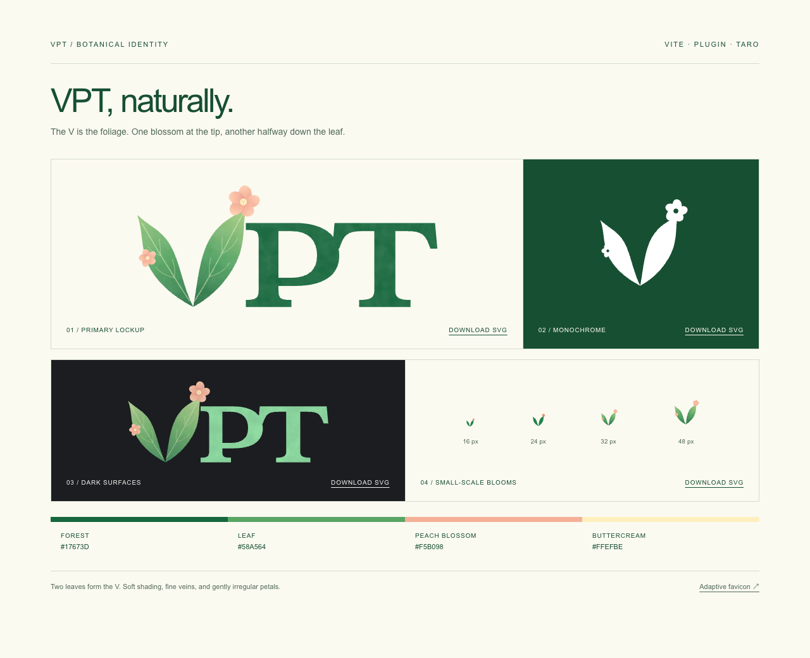

# VPT logo

**VPT, naturally.** The V itself is made from two growing leaves, not a solid letter decorated with foliage. Gently curved edges, soft green shading, fine branching veins, and two peach blossoms give the mark a botanical character: one flower sits at the right leaf's tip, and the smaller flower sits midway along the left leaf's outer edge. The petals have slightly different proportions and angles rather than perfect radial symmetry.

The leaf V is the first letter of the wordmark, followed by tightly kerned, custom serif P and T lettering. The P sits close to the leaf, and the P and T serifs meet, echoing the compact spacing of the original VPT title. All artwork is self-contained SVG with outlined lettering. The color versions use vector gradients; there are no fonts, external resources, raster textures, or scripts.

## Assets

| File | Use |
| --- | --- |
| [vpt-logo-light.svg](vpt-logo-light.svg) | Full botanical wordmark on light backgrounds |
| [vpt-logo-dark.svg](vpt-logo-dark.svg) | Lighter greens and cream lettering on dark backgrounds |
| [vpt-mark.svg](vpt-mark.svg) | Standalone two-leaf V with blossoms |
| [vpt-mark-mono.svg](vpt-mark-mono.svg) | Single-color leaf silhouettes with transparent flower centers |
| [../favicon.svg](../favicon.svg) | Adaptive small-size version with two leaves and one blossom |
| [preview.html](preview.html) | Visual sheet with downloads and actual-size samples; open directly or at `/brand/preview.html` on the docs site |
| [preview.png](preview.png) | Shareable 1280 × 1040 capture of the visual sheet |

## Usage

- Use the full wordmark at **80 px wide or larger**, and the detailed standalone mark at **32 px or larger**.
- At **16–24 px**, use the favicon. It keeps the two-leaf silhouette but omits gradients, veins, flower centers, and the smaller blossom.
- Keep at least **16 units of clear space** around the visible artwork on the 128-unit mark grid.
- Preserve the proportions and transparent background. Do not stretch, rotate, or separate the leaves.
- The monochrome SVG uses a luminance mask for transparent flower centers. Set `color` when inlining it, or replace `currentColor` for a fixed-color export. A page's text color does not pass into an external SVG image.

The palette pairs forest lettering `#174f32` with green leaf gradients, peach petals, and buttercream centers. Representative midtones are leaf `#58a564`, peach `#f5b098`, and buttercream `#ffefbe`. Light surfaces use `#fbfaf1`; dark surfaces use `#1b1d21` with cream lettering `#f4f3ef`.

The documentation header and homepage hero reuse the same SVG artwork. The hero applies the original theme-green lettering and stamp texture; the downloadable assets keep their original colors. Both follow the site theme, while the favicon follows the system theme.
