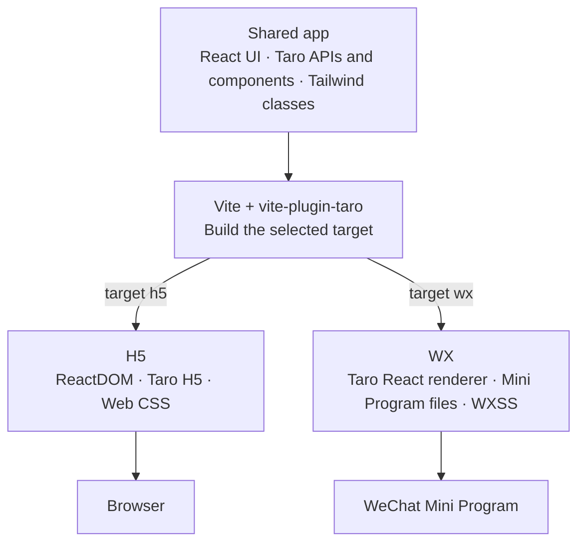

# vite-plugin-taro Core Architecture

## Goal

`vite-plugin-taro` builds one React/Taro source tree for two different environments:

- an H5 application rendered in the browser;
- a WeChat Mini Program rendered through native Mini Program files and the Taro runtime.

The plugin does not run the Taro CLI or adapt Taro's webpack pipeline. Vite owns the build, development server, module graph, JavaScript transforms, CSS pipeline, and assets. Taro is used for the cross-platform runtime behavior that should not be reimplemented: APIs, components, routing, the Mini Program React renderer, and native template generation.

The core model is:

> Vite builds the application, React defines the UI, Taro maps that UI and its APIs to each platform, Tailwind generates shared styles, and `vite-plugin-taro` connects those systems into a complete target-specific application.

## Architecture

The shared app enters one Vite build. The selected target connects it to either the browser runtime or the Mini Program runtime and output format.

Each system has one primary responsibility:

| System | Responsibility |
| --- | --- |
| Vite and Rolldown | Own the module graph, target build, development server, JavaScript, CSS, assets, and plugin lifecycle. |
| React | Own the shared component model, rendering updates, hooks, and component state. |
| Taro | Provide cross-platform APIs and components, H5 routing, the WX React renderer, and Mini Program template behavior. |
| Tailwind CSS | Generate utilities and design tokens from the shared source and stylesheets. |
| `vite-plugin-taro` | Select one target, generate its application entries, connect the correct Taro and React runtimes, and materialize the required output files. |

## One source model, one target per Vite run

The App component, page list, page configuration, and Mini Program configuration are declared in Vite configuration. This is the complete project model used by the plugin.

A single Vite run builds either `h5` or `wx`, never both. The targets require different module aliases, environment defines, renderers, entry graphs, CSS transforms, output formats, and development behavior. Keeping one target per graph prevents browser and Mini Program implementations from leaking into each other. Both targets can still run concurrently in separate Vite processes.

The plugin does not read Taro CLI files such as `config/index.ts`, `app.config.ts`, or page `config.ts` files. Maintaining one configuration source avoids conflicting build models and lets Vite know the complete App and page graph before bundling begins.

## Shared application boundary

Application code is shared through three stable boundaries.

### React components

The App and page modules are normal React components. The App receives the active page as its children, while every configured page path resolves to a page component in the source tree.

The plugin generates target entries from this configuration. Application code does not need to maintain a browser `main.tsx`, Mini Program `App(...)` setup, native `Page(...)` registration, or route table by hand.

### Taro APIs and components

Application code imports Taro through `virtual:taro/api` and `virtual:taro/components`. These imports are target-neutral and keep direct `@tarojs/*` package details out of the application graph.

This boundary is important for two reasons:

1. H5 and WX need different implementations of the same Taro surface.
2. The plugin must keep the Taro packages, React renderer, and platform runtimes on compatible versions.

For H5, Taro API access resolves to the H5 platform implementation and Taro components resolve to browser React components. For WX, the Mini Program platform runtime installs native API behavior and the components feed Taro's Mini Program renderer.

### Target-specific source blocks

Taro-style `#ifdef`, `#ifndef`, `#else`, and `#endif` blocks are removed before Vite parses a module. The inactive branch therefore never enters the target's module graph. This works for JavaScript, TypeScript, JSX, and stylesheets, and allows the shared source tree to contain small platform-specific sections without creating two applications.

## Shared build pipeline

After the target is selected, the plugin composes one Vite pipeline:

1. Resolve the App, pages, and shared configuration.
2. Remove inactive conditional-compilation blocks.
3. Resolve the virtual Taro API and component imports.
4. Run the Tailwind and CSS transforms for the selected target.
5. Run Vite's React transform for JSX and React Refresh instrumentation.
6. Generate the target's App, page, and runtime entries.
7. Let Vite and Rolldown build the final JavaScript graph and assets.
8. Add target files that cannot be represented as JavaScript modules.

The target adapter changes the shape of the application, but it does not create a second build system. Vite still sees one graph and remains responsible for invalidation, code splitting, asset imports, development, and production output.

There is also a strict build-time/runtime boundary. Node-side plugin code may use Vite and Taro's platform builders to generate output. Code emitted into the application uses only browser or Mini Program runtimes; it does not depend on Node or Vite implementation modules.

## H5 target

H5 is the direct browser path.

The plugin injects a generated module entry into the application's normal `index.html`. That entry:

- initializes the shared App configuration;
- turns the configured pages into lazy route records;
- creates Taro's hash-history router;
- loads pages through Vite dynamic imports;
- mounts the App through ReactDOM.

React renders to the browser DOM. Taro's H5 router supplies page navigation and lifecycle integration, while Taro's H5 components provide browser implementations of components such as `View`, `Text`, and `ScrollView`. Taro API imports are transformed to the H5 platform API implementation.

The result remains a normal Vite web application. It uses the standard Vite development server, browser module loading, asset handling, production bundling, and React Fast Refresh.

### Why generate the H5 entry

The route list and App configuration already exist in plugin options. Generating the entry makes that configuration the source of truth and avoids a second manually maintained route table or bootstrap module. It also guarantees that H5 and WX use the same ordered page list.

## WX target

WX requires a native Mini Program project rather than an HTML application. The plugin therefore turns the same project model into two connected outputs:

- a CommonJS JavaScript graph built by Vite and Rolldown;
- Mini Program files such as App/page JSON, WXML, WXSS, WXS, and project configuration.

The generated JavaScript graph contains a native App entry, one entry for every page, and the shared recursive component used by Taro's Mini Program renderer. The App entry initializes the React/Taro application. Each page entry connects its React page component to a native `Page(...)` configuration.

React does not render directly to WXML. Taro's React renderer reconciles the React tree into Taro's in-memory document model. Taro-generated templates and the recursive native component project that document model into the Mini Program UI and route events back through Taro. This preserves Taro's established rendering behavior while Vite remains the JavaScript bundler.

The plugin reuses Taro's WeChat platform template builder to generate the recursive templates, script helpers, component configuration, and page templates. It does not reimplement Taro's template protocol.

### Why WX needs generated native files

A Mini Program requires files and registrations that have no browser-module equivalent. Vite can build the JavaScript and imported assets, but it does not know how to create `app.json`, page JSON, WXML templates, or native component configuration. The WX target fills only that platform gap and leaves the module graph with Vite.

## React 19

Both targets use the same React 19 components and hooks, but they render through different hosts:

- H5 uses ReactDOM and the browser DOM.
- WX uses Taro's custom React reconciler and Taro document model.

Vite's React plugin owns JSX transformation and browser Fast Refresh. The WX development runtime adapts the same React Refresh model to WeChat's page reload behavior.

Taro 4.2's published React renderer requires a small compatibility update for React 19's reconciler host interface and root API. The repository therefore publishes generated support packages built from the official Taro tarballs plus narrow React 19 patches. This keeps Taro's renderer behavior intact while making the React version explicit and reproducible. These packages are implementation dependencies of the plugin, not application-facing APIs.

## Tailwind CSS and styles

Tailwind participates in the same Vite CSS graph as ordinary CSS, Sass, Less, and Stylus. Tailwind v4 reads the shared CSS-first configuration and scans the shared source for utility candidates. `weapp-tailwindcss` then applies the target-specific representation.

### H5 styles

For H5, Tailwind produces web CSS and normal browser class names. Taro's global component styles are loaded before application styles so the application can override them. Taro components implemented with Stencil may insert styles at runtime, so their insertion point is adjusted to preserve the same ordering.

### WX styles

For WX, JavaScript class strings and generated CSS must be transformed together. Mini Program output may require escaped class names, selector changes, and unit conversion such as `rem` or `px` to `rpx`. The same `weapp-tailwindcss` context transforms both sides so rendered class names continue to match the generated WXSS.

Vite's collected application CSS is currently materialized in native `app.wxss`. Taro's native component and template
configuration then makes those styles available to the rendered page tree.

Bare DevTools probes establish a file-specific WXSS boundary: changing `page.wxss` updates styles while retaining the
App, page module, and Page instance. Changing `app.wxss` instead reloads the App and loses its runtime state. The
current CSS pipeline does not yet partition source styles by route, so source CSS edits still rebuild `app.wxss` and
take the state-losing App-reload path. Route-partitioned, state-preserving WXSS hot reload is planned and will be
supported soon.

During JavaScript HMR, a patch may reuse utility classes already present in the current WXSS. Introducing a new Tailwind
candidate requires a full native rebuild so JavaScript class names and WXSS cannot diverge. A future state-preserving
page-style path would also need explicit ownership for page-local, shared, and global rules. The detailed update
protocol is described in `draft/hmr-architecture.md`.

### Why styles need a shared pipeline

Transforming only CSS would break class names emitted by React, while transforming only JSX would produce names with no matching WXSS rule. Keeping source scanning, class rewriting, and CSS generation in one target-aware pipeline guarantees that markup and styles agree.

## Development model

The two targets share source and transforms but use development behavior appropriate to their runtime.

### H5 development

H5 uses Vite's normal browser development model. The browser loads modules from the Vite server, and React Fast Refresh applies compatible component updates.

### WX development

WX development uses Vite's bundled Rolldown graph because DevTools consumes a native project directory rather than
browser modules. Compatible JavaScript updates stay in memory and are delivered through `update.js`, the only project
file rewritten for those updates. The current app-level CSS output, native configuration, assets, and unsafe changes
produce a complete native build. Although DevTools can update a direct `page.wxss` without replacing App state, the
plugin does not yet emit route-partitioned CSS updates.

This separation is deliberate: the plugin shares the source model and module graph concepts, not a transport that only works in browsers.

## Why Taro is used as a runtime rather than a build system

The reusable part of Taro is its platform abstraction:

- component semantics;
- API normalization;
- routing behavior;
- React-to-Mini-Program reconciliation;
- native template generation.

The replaceable part is the old build orchestration. Vite and Rolldown already provide a modern module graph, plugin pipeline, development server, CSS processing, asset handling, and production bundling. Running Taro's webpack pipeline inside or beside Vite would create two competing graphs and make invalidation, aliases, CSS, and assets ambiguous.

The plugin therefore keeps Taro below the build boundary and Vite above it: Taro defines how the application behaves on a target, while Vite determines how application modules become output.

## Why target adapters remain separate

H5 and WX share component source, but their runtime contracts are fundamentally different:

- H5 starts from HTML, uses ES modules in development, renders through ReactDOM, and navigates with a browser history.
- WX starts from native App and page registrations, consumes CommonJS output, renders through Taro's document model and WXML templates, and requires native configuration files.

Trying to hide those differences in one universal entry would make both targets harder to reason about. The architecture shares everything before target materialization—project model, source transforms, React components, Taro facade, and Tailwind design system—then gives each target an explicit final adapter.

## Why the architecture is sufficient

The shared source can run on both targets because every platform-dependent decision has one owner:

1. Virtual Taro imports keep application code independent of package-level platform resolution.
2. Target defines and aliases select the correct Taro runtime behavior.
3. Generated entries connect the configured App and pages to the target renderer.
4. React preserves one component model while ReactDOM or Taro provides the host renderer.
5. The Tailwind pipeline emits class names and styles for the same selected target.
6. Vite and Rolldown build one internally consistent module graph.
7. Target-specific output generation supplies only the native files Vite cannot produce itself.

No second route graph, CSS graph, or JavaScript build graph is introduced.

## Guarantees and limits

The architecture guarantees one configuration-driven build graph per target and one shared React/Taro source model. It is designed to keep page ordering, target configuration, module resolution, renderer selection, and style generation consistent within that graph.

The current boundaries are intentional:

- only React is supported;
- only `h5` and `wx` targets are implemented;
- each Vite run selects one target;
- application code imports Taro through the plugin's virtual modules rather than directly from `@tarojs/*`;
- App and page configuration comes from plugin options rather than Taro CLI config files;
- platform-specific behavior may still require conditional source blocks;
- the current WX pipeline uses a complete native rebuild for changes that require native files; the observed safe
  `page.wxss` boundary is not yet a generated update path.

Within those boundaries, Taro application semantics are retained without retaining Taro's webpack build architecture.
