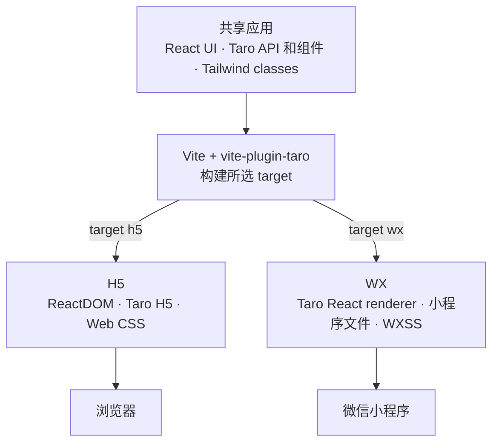

# vite-plugin-taro 核心架构

## 目标

`vite-plugin-taro` 使用同一份 React/Taro 源码构建两个不同的运行环境：

- 在浏览器中渲染的 H5 应用；
- 通过原生小程序文件和 Taro runtime 渲染的微信小程序。

插件不运行 Taro CLI，也不适配 Taro 的 webpack pipeline。Vite 负责构建、开发服务器、module graph、JavaScript transform、CSS pipeline 和资源处理。Taro 负责不应重复实现的跨平台 runtime 行为，包括 API、组件、路由、小程序 React renderer 和原生模板生成。

核心模型是：

> Vite 构建应用，React 定义 UI，Taro 把 UI 和 API 映射到各个平台，Tailwind 生成共享样式，`vite-plugin-taro` 把这些系统连接成完整的目标应用。

## 架构

共享应用进入一次 Vite 构建。所选 target 决定连接浏览器 runtime，还是小程序 runtime 和输出格式。

每个系统有一个主要职责：

| 系统 | 职责 |
| --- | --- |
| Vite 和 Rolldown | 负责 module graph、目标构建、开发服务器、JavaScript、CSS、资源和 plugin lifecycle。 |
| React | 负责共享组件模型、渲染更新、hooks 和组件状态。 |
| Taro | 提供跨平台 API 和组件、H5 路由、WX React renderer 和小程序模板行为。 |
| Tailwind CSS | 根据共享源码和样式表生成 utilities 和设计 token。 |
| `vite-plugin-taro` | 选择一个 target，生成应用入口，连接正确的 Taro 和 React runtime，并输出目标所需文件。 |

## 一份源码模型，每次 Vite 运行构建一个 target

App 组件、页面列表、页面配置和小程序配置都声明在 Vite 配置中。这些配置构成插件使用的完整项目模型。

一次 Vite 运行只构建 `h5` 或 `wx`，不会同时构建两者。两个 target 需要不同的 module alias、环境 define、renderer、入口图、CSS transform、输出格式和开发行为。每个 module graph 只包含一个 target，可以避免浏览器和小程序实现互相混入。两个 target 仍然可以通过两个独立的 Vite 进程同时运行。

插件不读取 `config/index.ts`、`app.config.ts` 或页面 `config.ts` 等 Taro CLI 配置文件。只维护一个配置来源，可以避免两套构建模型冲突，也让 Vite 在 bundling 开始前就知道完整的 App 和页面结构。

## 共享应用边界

应用代码通过三个稳定边界共享。

### React 组件

App 和页面模块都是普通 React 组件。App 通过 children 接收当前页面，每个已配置页面路径都对应源码中的一个页面组件。

插件根据这些配置生成 target 入口。应用代码不需要手动维护浏览器 `main.tsx`、小程序 `App(...)` 初始化、原生 `Page(...)` 注册或路由表。

### Taro API 和组件

应用代码通过 `virtual:taro/api` 和 `virtual:taro/components` 导入 Taro。两个 import 与 target 无关，也把直接的 `@tarojs/*` 包细节隔离在应用 module graph 之外。

这个边界有两个作用：

1. H5 和 WX 需要同一套 Taro 接口的不同实现。
2. 插件必须保证 Taro packages、React renderer 和平台 runtime 版本兼容。

H5 下，Taro API 会解析到 H5 平台实现，Taro 组件会解析到浏览器 React 组件。WX 下，小程序平台 runtime 安装原生 API 行为，组件则进入 Taro 的小程序 renderer。

### Target-specific 源码块

Taro 风格的 `#ifdef`、`#ifndef`、`#else` 和 `#endif` 代码块会在 Vite 解析模块前被移除。未启用的分支不会进入当前 target 的 module graph。这个机制支持 JavaScript、TypeScript、JSX 和样式表，让共享源码可以包含少量平台专用代码，而不需要拆成两个应用。

## 共享构建 pipeline

选择 target 后，插件组合出一条 Vite pipeline：

1. 解析 App、pages 和共享配置。
2. 删除未启用的条件编译代码块。
3. 解析虚拟 Taro API 和组件 import。
4. 对当前 target 执行 Tailwind 和 CSS transform。
5. 执行 Vite React transform，处理 JSX 和 React Refresh instrumentation。
6. 生成 target 的 App、page 和 runtime 入口。
7. 由 Vite 和 Rolldown 构建最终 JavaScript graph 和资源。
8. 添加无法表示为 JavaScript 模块的目标文件。

Target 适配层会改变应用最终形态，但不会创建第二套构建系统。Vite 始终看到一个 module graph，并继续负责 invalidation、code splitting、资源 import、开发和生产输出。

构建时和运行时之间也有严格边界。Node 侧 plugin 可以使用 Vite 和 Taro 平台 builder 生成输出。进入应用的代码只使用浏览器或小程序 runtime，不依赖 Node 或 Vite 实现模块。

## H5 target

H5 是直接的浏览器路径。

插件向应用的普通 `index.html` 注入生成的 module entry。该入口会：

- 初始化共享 App 配置；
- 把配置中的 pages 转换为 lazy route records；
- 创建 Taro hash-history router；
- 通过 Vite dynamic import 加载页面；
- 使用 ReactDOM 挂载 App。

React 直接渲染到浏览器 DOM。Taro H5 router 提供页面导航和 lifecycle 集成，Taro H5 组件则提供 `View`、`Text` 和 `ScrollView` 等组件的浏览器实现。Taro API import 会被转换为 H5 平台 API 实现。

最终结果仍然是普通 Vite Web 应用，使用标准 Vite 开发服务器、浏览器模块加载、资源处理、生产 bundling 和 React Fast Refresh。

### 为什么生成 H5 入口

路由列表和 App 配置已经存在于 plugin options 中。自动生成入口可以让这些配置保持为唯一来源，避免额外手写并维护另一份路由表或 bootstrap 模块，也保证 H5 和 WX 使用相同顺序的页面列表。

## WX target

WX 需要原生小程序项目，而不是 HTML 应用。插件会把同一份项目模型转换为两部分相互连接的输出：

- 由 Vite 和 Rolldown 构建的 CommonJS JavaScript graph；
- App/page JSON、WXML、WXSS、WXS 和项目配置等小程序文件。

生成的 JavaScript graph 包含原生 App 入口、每个页面的入口，以及 Taro 小程序 renderer 使用的共享递归组件。App 入口初始化 React/Taro 应用，每个页面入口把对应 React 页面组件连接到原生 `Page(...)` 配置。

React 不直接渲染 WXML。Taro React renderer 把 React tree reconcile 到 Taro 的内存 document model。由 Taro 生成的模板和原生递归组件把这个 document model 映射到小程序 UI，并通过 Taro 回传事件。这样可以保留 Taro 已有的渲染行为，同时继续由 Vite 负责 JavaScript bundling。

插件复用 Taro 微信平台的 template builder，生成递归模板、script helpers、组件配置和页面模板，不重新实现 Taro 的模板协议。

### 为什么 WX 需要生成原生文件

小程序要求一些没有浏览器模块对应物的文件和注册。Vite 可以构建 JavaScript 和导入资源，但不知道如何生成 `app.json`、页面 JSON、WXML 模板或原生组件配置。WX target 只补足这部分平台差异，module graph 仍然由 Vite 管理。

## React 19

两个 target 使用相同的 React 19 组件和 hooks，但通过不同 host 渲染：

- H5 使用 ReactDOM 和浏览器 DOM。
- WX 使用 Taro 自定义 React reconciler 和 Taro document model。

Vite React plugin 负责 JSX transform 和浏览器 Fast Refresh。WX 开发 runtime 则把同一套 React Refresh 模型适配到微信的页面重载行为。

Taro 4.2 发布的 React renderer 需要少量兼容修改，才能支持 React 19 的 reconciler host interface 和 root API。因此仓库发布了基于官方 Taro tarball 加少量 React 19 patch 生成的支持包。这样既保留 Taro renderer 行为，也使 React 版本兼容明确且可复现。这些包是插件实现依赖，不是应用侧 API。

## Tailwind CSS 和样式

Tailwind 与普通 CSS、Sass、Less 和 Stylus 一起进入同一条 Vite CSS graph。Tailwind v4 读取共享的 CSS-first 配置，并扫描共享源码中的 utility candidates。之后由 `weapp-tailwindcss` 生成对应 target 的表示。

### H5 样式

H5 下，Tailwind 生成 Web CSS 和普通浏览器 class names。Taro 全局组件样式会先于应用样式加载，让应用可以覆盖默认样式。部分 Taro 组件由 Stencil 实现并在运行时插入样式，因此插件会调整它们的插入位置，保持相同的覆盖顺序。

### WX 样式

WX 下，JavaScript class strings 和生成的 CSS 必须一起转换。小程序输出可能需要转义 class names、修改 selector，以及把 `rem` 或 `px` 转换为 `rpx`。两部分使用同一个 `weapp-tailwindcss` context 处理，保证渲染出的 class names 与 WXSS 规则一致。

Vite 收集到的应用 CSS 目前会输出到原生 `app.wxss`。Taro 原生组件和模板配置再让这些样式应用到渲染后的
页面 tree。

裸微信 DevTools 探针确认了由文件决定的 WXSS 边界：修改 `page.wxss` 会更新样式，同时保留 App、页面模块
和 Page 实例；修改 `app.wxss` 则会重载 App 并丢失 runtime 状态。当前 CSS pipeline 尚未按路由拆分源码
样式，因此源码 CSS 修改仍会重建 `app.wxss`，并走丢失状态的 App 重载路径。按路由拆分且保留状态的 WXSS
热更新已经列入计划，即将支持。

JavaScript HMR 期间，patch 可以继续使用当前 WXSS 中已经存在的 utility classes。如果引入新的 Tailwind
candidate，就必须执行完整原生构建，避免 JavaScript class names 与 WXSS 不一致。未来若要实现保留状态的
页面样式更新，还需要明确页面局部、共享和全局规则的 ownership。详细更新协议见
`../hmr/hmr-draft-1.md`。

### 为什么样式需要共享 pipeline

只转换 CSS 会导致 React 输出的 class names 不匹配；只转换 JSX 则会产生没有对应 WXSS 规则的 class names。把源码扫描、class 重写和 CSS 生成放在同一条 target-aware pipeline 中，可以保证 markup 与样式一致。

## 开发模型

两个 target 共享源码和 transform，但各自使用适合当前 runtime 的开发方式。

### H5 开发

H5 使用 Vite 的普通浏览器开发模型。浏览器从 Vite server 加载模块，React Fast Refresh 应用组件更新。

### WX 开发

WX 开发使用 Vite bundled Rolldown graph，因为 DevTools 消费的是原生项目目录，而不是浏览器模块。
JavaScript 热更新保留在内存中，并通过 `update.js` 交付；这类更新只会改写这一个项目文件。当前 App 级
CSS 输出、原生配置、资源和不安全的修改会触发完整原生构建。虽然 DevTools 可以直接更新 `page.wxss`
而不替换 App 状态，但插件尚未输出按路由拆分的 CSS 更新。

这种区分是有意的：插件共享源码模型和 module graph 概念，而不是强行共享只适用于浏览器的传输方式。

## 为什么把 Taro 作为 runtime 而不是构建系统

Taro 中可以复用的是平台抽象：

- 组件语义；
- API normalization；
- 路由行为；
- React 到小程序的 reconciliation；
- 原生模板生成。

可以替换的是旧构建编排。Vite 和 Rolldown 已经提供现代 module graph、plugin pipeline、开发服务器、CSS 处理、资源处理和生产 bundling。如果在 Vite 内部或旁边再运行 Taro webpack pipeline，就会产生两套互相竞争的 graph，使 invalidation、alias、CSS 和资源归属变得不明确。

因此插件把 Taro 放在构建边界之下，把 Vite 放在构建边界之上：Taro 决定应用在 target 上如何运行，Vite 决定应用模块如何变成输出。

## 为什么 target 适配层保持独立

H5 和 WX 共享组件源码，但 runtime contract 完全不同：

- H5 从 HTML 启动，开发时使用 ES modules，通过 ReactDOM 渲染，并使用 browser history 导航。
- WX 从原生 App 和 page 注册启动，消费 CommonJS 输出，通过 Taro document model 和 WXML 模板渲染，并要求原生配置文件。

如果把这些差异隐藏在一个通用入口中，两个 target 都会更难理解。当前架构共享 target 输出之前的所有部分，包括项目模型、源码 transform、React 组件、Taro facade 和 Tailwind design system，然后为每个 target 提供明确的最终适配层。

## 为什么这个架构是充分的

共享源码能在两个 target 运行，是因为每个与平台相关的决策都有明确归属：

1. 虚拟 Taro import 让应用代码不依赖 package 层的平台解析。
2. Target defines 和 aliases 选择正确的 Taro runtime 行为。
3. 生成入口把配置中的 App 和 pages 连接到 target renderer。
4. React 保持同一套组件模型，由 ReactDOM 或 Taro 提供 host renderer。
5. Tailwind pipeline 为同一个已选 target 生成 class names 和样式。
6. Vite 和 Rolldown 构建一份内部一致的 module graph。
7. Target-specific 输出生成只补充 Vite 无法直接产生的原生文件。

整个过程中不会引入第二套路由 graph、CSS graph 或 JavaScript build graph。

## 保证与限制

该架构保证每个 target 只有一份由配置驱动的 build graph，并共享同一套 React/Taro 源码模型。它旨在让 page 顺序、target 配置、module resolution、renderer 选择和样式生成在同一 graph 内保持一致。

当前边界是有意设计的：

- 只支持 React；
- 只实现 `h5` 和 `wx` target；
- 每次 Vite 运行只选择一个 target；
- 应用代码通过插件虚拟模块导入 Taro，不直接导入 `@tarojs/*`；
- App 和页面配置来自 plugin options，而不是 Taro CLI 配置文件；
- 平台专用行为仍可能需要条件源码块；
- 当前 WX pipeline 对需要写入原生文件的修改执行完整原生构建；已观察到的安全 `page.wxss` 边界尚未成为
  生成更新路径。

在这些边界内，插件保留 Taro 应用语义，但不保留 Taro 的 webpack 构建架构。
