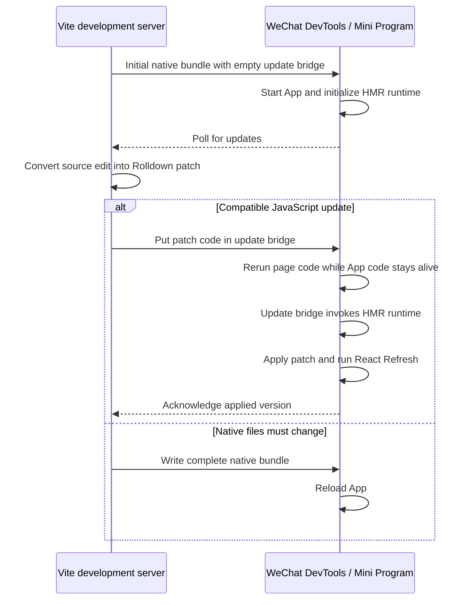

# WeChat Mini Program HMR Architecture

## The problem

Web HMR assumes that the running application can receive new JavaScript and execute it in place. WeChat Mini Programs do not provide that capability:

- executable code must be compiled by WeChat DevTools from a project file;
- code received through `wx.request` cannot be evaluated with `eval`, `Function`, or an equivalent mechanism;
- DevTools chooses how much of the Mini Program to reload from the file that changed;
- if DevTools reloads the App, the old JavaScript heap, Taro root, and React Fiber tree are gone.

React Refresh can preserve state only while the existing Fiber tree remains alive. The central problem is therefore not how to run React Refresh. It is how to deliver and execute new module code **without causing DevTools to rerun the App**.

## The key WeChat behavior

A pre-existing JavaScript file that is a direct static dependency of a page has a useful reload boundary:

- DevTools recompiles and reruns the page code when that dependency changes;
- `app.js` is not rerun;
- the existing JavaScript state remains available.

This is the opening that makes HMR possible. Page code may run again, while the HMR runtime, module registry, Taro root, React families, and Fiber tree survive because App code is not rerun.

The plugin reserves one direct page dependency for this purpose: the **update bridge**, emitted as `update.js`. During initial development startup it is empty. For every compatible JavaScript edit, the development server puts the generated patch code into this same bridge. As far as DevTools is concerned, only the known page dependency changed.

When DevTools reruns the page, it reaches the update bridge before normal page initialization. The bridge calls the already-running HMR runtime, which applies the patch. The rest of the page code can then rerun without becoming the owner of application state.

This is the core design:

> Convert arbitrary compatible source edits into changes to one page-scoped executable file, so WeChat reruns the page but keeps the App and React state alive.

## Architecture

There are two channels between the parties:

- The **control channel** uses `wx.request` to exchange build, session, and version metadata. It never carries executable source.
- The **execution channel** is the update bridge. The development server writes JavaScript into the project, and DevTools compiles it through the normal Mini Program toolchain.

The control channel decides *which* patches are missing. The execution channel is the only mechanism that can safely run them.

## Initial development build

Development uses one eager Vite/Rolldown module graph. The same graph produces both the initial complete native bundle—the **baseline**—and every later patch. This keeps module IDs, transforms, dependency boundaries, and React Refresh instrumentation consistent between the baseline and its updates.

The initial output establishes three important conditions:

1. The App starts the HMR runtime and control client.
2. Every page has a direct static dependency on the empty update bridge.
3. Every configured page component is initialized eagerly.

The third condition is needed for inactive routes. A patch may update a page that has never been opened. Eager initialization gives that page's modules a place in the live module registry, so the patch can be applied immediately and will still be present when the route is opened later. It does not create native page instances.

## Compatible update flow

For a compatible source edit:

1. Rolldown DevEngine computes a patch from the existing development graph.
2. The server verifies that the patch can be applied without changing native files such as WXSS, WXML, JSON, or assets.
3. The patch is transformed to JavaScript syntax accepted by WeChat.
4. The server assigns it the next version and retains it in memory.
5. The client reports its current version through the control channel.
6. The server places the client's missing patch range into the update bridge.
7. DevTools sees the changed page dependency and reruns the active page code without rerunning the App.
8. The update bridge invokes the HMR runtime, which applies the patches in order.
9. React Refresh reconciles the new component implementations with the retained Fiber tree.
10. The client acknowledges the new version only after Refresh has completed.

The source edit may have been in an App component, an active page, an inactive page, or a shared dependency. In the compatible path, the development server does not expose that source file as a separate native file change. The only executable file DevTools sees changing is the update bridge.

## The HMR runtime

The HMR runtime survives page reruns because App code is not rerun. It combines three responsibilities.

### Apply Rolldown patches

It owns the live module registry, current exports, hot contexts, and accepted update boundaries. Patch code updates this registry rather than loading a second copy of the application.

The runtime also records modules initialized by a patch. When DevTools continues rerunning the page's original bundled code, an old baseline initializer must not overwrite the module that was just updated. In that case the initializer resolves the current patched exports instead.

This is what makes the order safe:

- the update bridge installs the new module implementations;
- the remaining page code reruns;
- stale baseline initialization cannot replace the new implementations.

### Preserve React state

The HMR runtime uses Vite's official React Refresh runtime. Rolldown updates module exports and invokes accepted boundaries; React Refresh decides whether the affected component families are compatible.

For compatible families, React reuses the existing Fiber tree and component state. The Fiber tree is not serialized into the update bridge or copied into a patch. It simply remains reachable because the App code and Taro root were never destroyed.

If React reports a stale family that cannot be refreshed safely, the active route is relaunched. State preservation is intentionally limited to updates React Refresh considers compatible.

### Make page rerun harmless

Page entry code is native integration code and may execute again. The HMR runtime treats it as disposable setup rather than durable application state.

The rerun is guarded so that it cannot:

- register the same native route twice;
- restore stale baseline module implementations;
- replace new React Refresh registrations with old ones;
- detach the retained Taro/React root.

The native page context is reconnected to the retained root after the update. WeChat's synthetic page-side effects are filtered as an implementation detail of this reconnection; they are not the architectural basis of HMR.

## Reliable patch delivery

Filesystem notifications, HTTP responses, page reruns, and React Refresh do not form one atomic operation. The protocol therefore uses versions rather than assuming event delivery order.

The server tracks:

- a **build ID** for the current complete baseline;
- a monotonically increasing **patch version**;
- the retained patches for that baseline;
- the active HMR client **session**;
- at most one published patch range awaiting acknowledgement.

The client repeatedly reports the version it has actually applied. If it is behind, the server publishes one contiguous missing range into the update bridge. Changes arriving while that range is in flight wait for the next publication.

A file write is not considered success. The client acknowledges only after patch execution and React Refresh complete. If DevTools misses the file event, the client continues reporting the old version and the server republishes the same range with different file content. If the same batch is observed twice, version checks prevent duplicate application.

This stop-and-wait model favors correctness over throughput. HMR updates are small and interactive, while an out-of-order or falsely acknowledged patch can corrupt the live module graph.

## Restarts and replay

### HMR client restart

The development server may still be running when DevTools reloads the App. The new HMR client creates a new session and starts at version zero. The server then republishes all patches retained since the current baseline.

Eager page initialization ensures those patches can be replayed even for routes that have not yet been opened since the reload.

### Development-server restart

Patch history is intentionally kept only in server memory. When Vite restarts, it creates a new complete baseline and a new build ID. The latest source is already represented in that bundle, so old patch history is neither needed nor trusted.

The new baseline resets the update bridge and patch versions to zero.

### Bounded history

Retained patch history is bounded. When it grows too large, the server creates a new complete baseline and clears the old history. This keeps long development sessions from accumulating an unbounded replay log.

## Full-build boundary

Only updates that can be expressed as safe JavaScript patches use the state-preserving path. A complete native rebuild is required when an edit changes or may change:

- WXSS or newly required Tailwind utilities;
- WXML, JSON, project configuration, or page configuration;
- imported assets or public files;
- output that Rolldown cannot associate with a valid HMR boundary;
- protocol state that cannot be reconciled safely;
- a patch that throws while executing.

A complete rebuild may reload the App, so React state preservation is not promised.

This fallback is not merely conservative. Once DevTools chooses an App-level reload, the old heap and Fiber tree are already gone. No later HMR logic can recover them.

## Why this design is necessary

The design follows directly from the platform constraints:

1. New code cannot be executed from the network, so DevTools must compile a project file.
2. React state cannot survive an App reload, so the changed file must select page-only rerun.
3. The file must already be a direct static page dependency, otherwise DevTools does not establish the required reload boundary early enough.
4. The HMR runtime must survive so it can apply the patch while the page reruns.

Therefore the fixed update bridge is not an arbitrary transport choice. It is the minimum mechanism that simultaneously provides executable code and keeps the running App intact.

## Why this design is sufficient

For a compatible update, every required property is established:

1. DevTools compiles the patch code from the update bridge.
2. Only page code reruns; App code and its existing JavaScript state remain intact.
3. The HMR runtime applies patches to the existing module registry.
4. Page rerun guards prevent baseline code from undoing the patch.
5. React Refresh reconciles against the retained Fiber tree.
6. Versioned acknowledgement guarantees patches are applied as one ordered prefix.

If any property cannot be guaranteed, the update uses a complete rebuild instead.

## Why simpler alternatives do not work

### Sending source over HTTP or WebSocket

The Mini Program can receive source text but cannot execute it without forbidden dynamic-code mechanisms. The control channel can carry metadata, not patches.

### Rewriting the original output files

Changing arbitrary JavaScript or native output files gives DevTools freedom to reload the App. That destroys the state HMR is intended to preserve.

### Dynamic or transitive update imports

A dependency discovered while the page is already rerunning is too late to define the safe reload boundary. The update bridge must exist and be a direct static page dependency in the initial bundle.

### Recreating application state after reload

Serializing selected values is not equivalent to preserving the live React Fiber tree, hook state, native input state, module graph, and Taro root. The architecture keeps those objects alive instead of attempting to reconstruct them.

## Guarantees and limits

For a compatible JavaScript update, the architecture is designed to preserve:

- the running App and its existing JavaScript state;
- the active route and native page state;
- the Taro root;
- native input state;
- React state for compatible component families.

It does not guarantee preservation of:

- arbitrary module-local singleton state;
- incompatible React component families;
- state across a complete native rebuild;
- state across a development-server restart.

The DevTools observations establishing the direct-page-dependency requirement are recorded in `draft/hmr-probe-result.md`.
