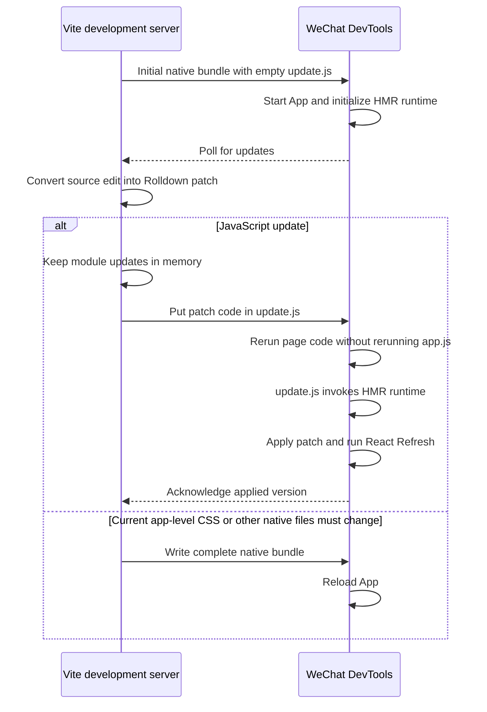

# WeChat Mini Program HMR Architecture

## The problem

Web HMR assumes that the running application can receive new JavaScript and execute it in place. WeChat Mini Programs do not provide that capability:

- executable code must be compiled by WeChat DevTools from a project file;
- code received through `wx.request` cannot be evaluated with `eval`, `Function`, or an equivalent mechanism;
- DevTools chooses how much of the Mini Program to reload from the file that changed;
- if DevTools reloads the App, the old JavaScript heap, Taro root, and React Fiber tree are gone.

React Refresh can preserve state only while the existing Fiber tree remains alive. The central problem is how to deliver and execute new module code **without causing DevTools to rerun the App**.

## The key WeChat behavior

State-preserving reloads require the WeChat project setting `compileHotReLoad: true`. All behavior described below
assumes that setting remains enabled.

Bare DevTools probes show a useful JavaScript reload boundary for `page.js` and files loaded directly by its initial
code.

Here, “loaded by a literal `require()`” has a precise meaning: the initial `page.js` contains a call such as
`require('./update.js')`. A file loaded through another module, or through a path assembled at runtime, is not inside
this boundary.

When `page.js` itself or one of these directly loaded files changes:

- DevTools recompiles and reruns page-side code;
- `app.js` is not rerun;
- the App instance, `globalData`, and App-owned runtime remain available.

This is the opening that makes JavaScript HMR possible. Page code runs again, but `app.js` does not; the existing App
instance, HMR runtime, module registry, Taro root, and Fiber tree remain alive.

The plugin therefore makes every `page.js` directly `require()` the same `update.js` from the initial build onward. The
file is empty at development startup. For every JavaScript edit handled by HMR, the development server puts the
generated patch code into this file. As far as DevTools is concerned, only a file that the page already loaded directly
has changed.

When DevTools reruns the page, it executes `update.js` before normal page initialization. The file calls the
already-running HMR runtime, which applies the patch. The rest of the page entry then continues, while the HMR runtime
keeps the patched module exports active and ensures that the page is registered only once.

This is the core design:

> Convert source edits handled by HMR into changes to one page-scoped executable file, so WeChat reruns the page but
> keeps the App and React state alive.

Each HMR update writes **only `update.js`**. Updated module code and patch history stay
in the development server's memory; `app.js`, page bundles, shared chunks, and native files are not rewritten. The
server writes only the missing patch range into `update.js`. DevTools therefore observes a change to the known page
dependency and has no other file change that would trigger an App reload.

## Architecture

There are two channels between the parties:

- The **control channel** uses `wx.request` to exchange build, session, and version metadata. It never carries executable source.
- The **execution channel** is the `update.js` file. The development server writes JavaScript into the project, and DevTools compiles it through the normal Mini Program toolchain.

The control channel decides *which* patches are missing. The execution channel is the only mechanism that can safely run them.

## Why the control channel is needed

The `update.js` file is a one-way execution mechanism. Writing it tells DevTools that a project file changed, but it does not tell the development server whether DevTools observed the change, whether the patch finished, or which version the HMR runtime now holds.

Without feedback, the server could overwrite `update.js` with a newer patch before the previous one ran. A missed or coalesced file event could silently lose an update. After an App reload, the server would also have no way to distinguish the new HMR client from the previous one or know which patches must be replayed.

The control channel closes that loop. It lets the HMR client:

- identify its build ID and session;
- report the last version that actually completed React Refresh;
- let the server publish only the missing contiguous patch range;
- acknowledge success after execution rather than after a file write;
- keep reporting the old version when an update was missed, causing the server to republish it.

HTTP is used because `wx.request` is available in the Mini Program and the Vite development server already exposes a local HTTP server. Long polling is sufficient for low-volume HMR metadata. The channel does not execute code and does not need a WebSocket; executable patch code still travels only through `update.js`.

## Initial development build

Development uses one eager Vite/Rolldown module graph. The same graph produces both the initial complete native bundle and every later patch. This keeps module IDs, transforms, dependency boundaries, and React Refresh instrumentation consistent between the full bundle and its patches.

The initial output establishes three important conditions:

1. The App starts the HMR runtime and control client.
2. Every `page.js` directly loads the empty `update.js` file through a literal `require()` call.
3. Every configured page component is initialized eagerly.

The third condition is needed for inactive routes. A patch may update a page that has never been opened. Eager initialization gives that page's modules a place in the live module registry, so the patch can be applied immediately and will still be present when the route is opened later. It does not create native page instances.

## State-preserving update flow

A JavaScript edit is applied as follows:

1. Rolldown DevEngine computes a patch from the existing development graph.
2. The server verifies that the patch can be applied without changing native files such as WXSS, WXML, JSON, or assets.
3. The patch is transformed to JavaScript syntax accepted by WeChat.
4. The server assigns it the next version and retains it in memory.
5. The client reports its current version through the control channel.
6. The server places the client's missing patch range into `update.js`.
7. DevTools sees the changed page dependency and reruns the active page code without rerunning the App.
8. `update.js` invokes the HMR runtime, which applies the patches in order.
9. React Refresh reconciles the new component implementations with the retained Fiber tree.
10. The client acknowledges the new version only after Refresh has completed.

This applies whether the edit comes from an App component, the active page, an inactive page, or a shared dependency.

## The HMR runtime

The HMR runtime remains attached to the existing App runtime because `app.js` is not rerun. It combines three
responsibilities.

### Apply Rolldown patches

It owns the live module registry, current exports, hot contexts, and accepted update boundaries. Patch code updates this registry rather than loading a second copy of the application.

The runtime also records modules initialized by a patch. When DevTools continues rerunning the page's original bundled code, an initializer from the original bundle must not overwrite the module that was just updated. In that case the initializer resolves the current patched exports instead.

This is what makes the order safe:

- `update.js` installs the new module implementations;
- the remaining page code reruns;
- stale initialization from the original bundle cannot replace the new implementations.

### Preserve React state

The HMR runtime uses Vite's official React Refresh runtime. Rolldown updates module exports and invokes accepted
boundaries; React Refresh decides whether the affected component state can be reused safely.

React Refresh determines whether the affected component state can be reused. When it can, React reuses the existing
Fiber tree and component state. The Fiber tree is not serialized into `update.js` or copied into a patch. It simply
remains reachable because the existing App instance and Taro root were never destroyed.

If React Refresh cannot safely update a component, the active route is relaunched and that component state is reset.

### Make page rerun harmless

Page entry code is native integration code and executes again during these updates. The HMR runtime treats this as
repeated integration setup and guards its side effects.

The rerun is guarded so that it cannot:

- register the same native route twice;
- restore stale module implementations from the original bundle;
- replace new React Refresh registrations with old ones;
- detach the retained Taro/React root.

The native page context is reconnected to the retained root after the update. WeChat's synthetic page-side effects are filtered as an implementation detail of this reconnection; they are not the architectural basis of HMR.

## Reliable patch delivery

Filesystem notifications, HTTP responses, page reruns, and React Refresh do not form one atomic operation. The protocol therefore uses versions rather than assuming event delivery order.

The server tracks:

- a **build ID** for the current full build;
- a monotonically increasing **patch version**;
- the patches retained since that full build;
- the active HMR client **session**;
- at most one published patch range awaiting acknowledgement.

The client repeatedly reports the version it has actually applied. If it is behind, the server publishes one contiguous missing range into `update.js`. Changes arriving while that range is in flight wait for the next publication.

A file write is not considered success. The client acknowledges only after patch execution and React Refresh complete. If DevTools misses the file event, the client continues reporting the old version and the server republishes the same range with different file content. If the same batch is observed twice, version checks prevent duplicate application.

This stop-and-wait model favors correctness over throughput. HMR updates are small and interactive, while an out-of-order or falsely acknowledged patch can corrupt the live module graph.

## Restarts and replay

### HMR client restart

The development server may still be running when DevTools reloads the App. The new HMR client creates a new session and starts at version zero. The server then republishes all patches retained since the current full build.

Eager page initialization ensures those patches can be replayed even for routes that have not yet been opened since the reload.

### Development-server restart

Patch history is intentionally kept only in server memory. When Vite restarts, it creates a new full build and a new build ID. The latest source is already represented in that bundle, so old patch history is neither needed nor trusted.

The new full build resets `update.js` and patch versions to zero.

### Bounded history

Retained patch history is bounded. When it grows too large, the server creates a new full build and clears the old history. This keeps long development sessions from accumulating an unbounded replay log.

## Full-build boundary

State-preserving HMR accepts only safe JavaScript patches. A complete native rebuild is required when an edit changes
or may change:

- application CSS currently materialized as `app.wxss`, including newly required Tailwind utilities;
- WXML, JSON, project configuration, or page configuration;
- imported assets or public files;
- output that Rolldown cannot associate with a valid HMR boundary;
- protocol state that cannot be reconciled safely;
- a patch that throws while executing.

A direct page-owned `page.wxss` update is safe at the DevTools level and does not replace App state. The current plugin
cannot use the `page.wxss` boundary for general source CSS because its styles are aggregated into `app.wxss`. Until CSS
ownership and route splitting exist, CSS edits still require a complete build. State-preserving WXSS hot reload is the
next planned extension and will be supported soon.

A build that rewrites `app.wxss` reloads the App in the tested DevTools environment, so the old heap, HMR runtime, Taro
root, and Fiber tree are gone. No later HMR logic can recover them.

## Why this design is necessary

The design follows directly from the platform constraints:

1. New code cannot be executed from the network, so DevTools must compile a project file.
2. React state cannot survive an App reload, so the changed file must select page-only rerun.
3. The file must already be a direct static page dependency, otherwise DevTools does not establish the required reload boundary early enough.
4. The HMR runtime must survive so it can apply the patch while the page reruns.

Therefore the fixed `update.js` file is not an arbitrary transport choice. It is the minimum mechanism that simultaneously provides executable code and keeps the running App intact.

## Why this design is sufficient

A JavaScript HMR update establishes every required property:

1. DevTools compiles the patch code from `update.js`.
2. Only page code reruns; `app.js` does not, so the existing App instance and JavaScript state remain intact.
3. The HMR runtime applies patches to the existing module registry.
4. Page rerun guards prevent code from the original bundle from undoing the patch.
5. React Refresh reconciles against the retained Fiber tree.
6. Versioned acknowledgement guarantees patches are applied as one ordered prefix.

If any property cannot be guaranteed, the update uses a complete rebuild instead.

## Why simpler alternatives do not work

### Sending source over HTTP or WebSocket

The Mini Program can receive source text but cannot execute it without forbidden dynamic-code mechanisms. The control channel can carry metadata, not patches.

### Rewriting the original output files

The safe boundary is file-specific, not permission to rewrite arbitrary generated output. A page's JavaScript and
`page.wxss` can avoid an App reload, but replacing original JavaScript bundles would bypass the live patch registry and
React Refresh coordination, while replacing `app.wxss` demonstrably reloads the App. The fixed `update.js` dependency
isolates executable updates from both hazards.

### Dynamic or transitive update imports

A dependency discovered while the page is already rerunning is too late to define the safe reload boundary. `update.js` must exist and be a direct static page dependency in the initial bundle.

### Recreating application state after reload

Serializing selected values is not equivalent to preserving the live React Fiber tree, hook state, native input state, module graph, and Taro root. The architecture keeps those objects alive instead of attempting to reconstruct them.

## Guarantees and limits

JavaScript HMR preserves:

- the running App and its existing JavaScript state;
- the active route and native page state;
- the Taro root;
- native input state;
- component state retained by React Refresh.

It does not guarantee preservation of:

- arbitrary module-local singleton state;
- component state that React Refresh cannot retain;
- state across a complete native rebuild;
- state across a development-server restart.

At the DevTools level, a direct `page.wxss` save also preserves the App and page-side identities, whereas an `app.wxss`
save replaces them. The current plugin still emits collected application styles through `app.wxss`, so source CSS edits
do not yet receive the page-level preservation guarantee.

The bare DevTools observations establishing the JavaScript and WXSS boundaries are recorded in
`draft/hmr-probe-result.md`.

## Skyline rendering

The project fully supports WeChat Skyline rendering, but WeChat DevTools itself does not currently support hot reload in
Skyline mode. This is a DevTools restriction, not a plugin limitation. HMR therefore uses the standard WebView renderer,
and generated development projects disable Skyline by default.
