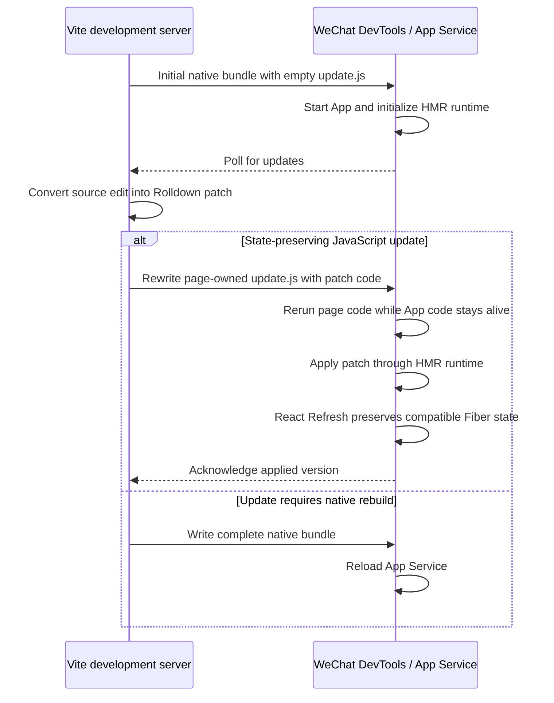

# WeChat Mini Program HMR Architecture

## Purpose

This document explains the WX development architecture implemented by `vite-plugin-taro`, from the platform constraint down to the algorithm owned by each participant.

The design is not a port of browser HMR. It is an execution protocol built around the only state-preserving code-execution path exposed by WeChat DevTools.

## The platform constraint

A browser HMR client can receive JavaScript over a socket and execute it in the existing page. A WeChat Mini Program cannot:

- the App Service does not permit `eval`, `Function`, or an equivalent general dynamic-code path;
- network responses therefore cannot be executable HMR payloads;
- DevTools must compile executable code from files in the Mini Program project;
- DevTools also decides which native runtime scope a changed file invalidates;
- if a change restarts the App Service, every old JavaScript object—including the Taro root and React Fiber tree—is lost.

The useful WeChat behavior is a narrower **page-scoped reload boundary**. When a pre-existing JavaScript file is a direct literal dependency of the active page, changing that file causes DevTools to execute the changed dependency and rerun the page code, but it does **not** rerun `app.js` or restart the App Service.

That asymmetry creates the entire opportunity for HMR:

```text
App code and App Service remain alive
    -> DevTools recompiles the affected page graph and starts the page entry again
    -> the page entry reaches its direct update.js require
    -> update.js applies embedded Rolldown patch code to the HMR runtime
    -> the rest of the rerun page initialization is isolated
    -> React Refresh reconciles against the existing Fiber tree
```

The page code may run again; the HMR runtime and React tree survive that rerun. The implementation deliberately moves every executable delta into one fixed page dependency so that arbitrary source edits are observed by Vite, but DevTools sees only the safe page-scoped `update.js` change.

A transitive or dynamically discovered file does not establish the same boundary early enough. Changing unrelated generated files can select a broader reload that destroys the state before the HMR runtime can act.

This gives the lower bound for state-preserving WX HMR:

1. DevTools must compile the new code because the application cannot evaluate source dynamically.
2. The physical file change must select page rerun rather than App rerun.
3. The HMR runtime must already exist and survive that page rerun.
4. Therefore executable deltas must be placed in a pre-existing direct literal page dependency.

The implementation reserves exactly one such dependency: `vpt-hmr/update.js`.

## Core idea

Every generated page begins with direct literal requires in this order:

```js
require('../../runtime.js')
require('../../vpt-hmr/preload.js')
require('../../vpt-hmr/update.js')
```

The relative prefix varies by route depth.

During normal startup, `update.js` contains only `void 0;`. For a compatible edit, the server atomically replaces it with executable JavaScript containing the missing Rolldown DevEngine patches. Its essential shape is:

```js
globalThis.__VITE_PLUGIN_TARO_WX_UPDATE_CLIENT__.receiveBatch(
    { buildId, fromVersion, targetVersion },
    () => {
        // Rolldown DevEngine patch code compiled by DevTools.
    }
)
```

DevTools notices the file and recompiles the affected page graph. When it starts the page entry again, the generated banner reaches the direct `update.js` require before the page's ordinary bundled initialization. `update.js` calls a client installed by the still-running App. The client executes the embedded patch callback, the guarded remainder of the page entry runs, and React Refresh then reconciles the updated component families.

The Fiber tree is not serialized into the update file. It remains alive because `app.js` and the App Service are not rerun. The objects on `globalThis` are stable rendezvous points that let disposable page code reconnect to the long-lived update client, Rolldown runtime, Taro root, and React families:

| Global | Owner | Role |
| --- | --- | --- |
| `__VITE_PLUGIN_TARO_WX_CONTROL__` | `control.js` | local endpoint, token, and baseline identity |
| `__VITE_PLUGIN_TARO_WX_UPDATE_CLIENT__` | App update client | receives executable patch callbacks and owns client protocol progress |
| `__VITE_PLUGIN_TARO_WX_PAGE_UPDATE__` | runtime/page coordinator | bridges update execution, page-rerun isolation, and Refresh |
| `__rolldown_runtime__` | `runtime.js` | owns live module exports, hot contexts, and patch application |
| React Refresh globals | Refresh preamble | map new component implementations onto retained families |

The mechanism is therefore analogous to web HMR in capability, but not in transport:

| Browser HMR | WX HMR |
| --- | --- |
| socket carries metadata and executable module source | HTTP carries metadata only |
| browser dynamically imports or evaluates update code | DevTools compiles `update.js` as a project file |
| browser page remains alive | App code and App Service remain alive while page code reruns |
| HMR runtime applies module updates | WX Rolldown runtime applies module updates |
| React Refresh preserves compatible Fibers | React Refresh preserves compatible Fibers |

## Architecture

The system has two parties: the Vite development server and the WeChat DevTools/App Service runtime. They coordinate through a metadata-only HTTP control plane and a DevTools-observed project file.



The control channel coordinates versions but never carries executable source. The project file `update.js` carries the patch code because DevTools must compile it. The key invariant is that changing this page-owned file reruns page code without rerunning App code, so the HMR runtime and React state survive.

## Development output and execution order

A full development build emits the normal native WX CommonJS output plus three plugin-owned files:

- `vpt-hmr/control.js` — App-only transport URL, random token, and `buildId`;
- `vpt-hmr/preload.js` — eagerly initializes every configured page component;
- `vpt-hmr/update.js` — the one mutable direct page dependency.

The generated `app.js` directly requires `control.js` before it starts the update client. It deliberately does **not** require `update.js`: the update client must survive in App scope, while the mutable executable file must belong exclusively to the page-scoped reload boundary.

Every page directly requires:

1. `runtime.js`, so the custom Rolldown runtime and a fresh page-update generation exist;
2. `preload.js`, so all page component modules exist before a retained update is replayed;
3. `update.js`, so deltas execute from the page-scoped file before stale page initialization can take over;
4. the page's ordinary bundled code, which DevTools may rerun without rerunning the App.

Preloading is about JavaScript module availability, not native page creation. It allows an update for an inactive or never-opened route to modify an initialized module now, instead of being overwritten by that module's baseline initializer when the route is opened later.

The direct dependency and its order are generated as a Rolldown output banner because an ordinary transitive import cannot express the required DevTools execution semantics.

## Two update modes

### Incremental state-preserving update

An update is eligible only when DevEngine returns a JavaScript `Patch` with at least one HMR boundary, every changed source is JavaScript/TypeScript, and the patch contains no style-runtime operation. The CSS pipeline may still reject it if the edit introduces a Tailwind utility absent from the last complete WXSS build.

Eligible code is transformed for WX JavaScript syntax, retained as the next protocol version, and eventually published through `update.js`.

A successful compatible update preserves:

- the App Service and already-executed App code;
- native page and route state;
- the Taro root;
- native input state;
- React state for Refresh-compatible component families.

Module-local singleton state is not a general preservation guarantee.

### Complete rebuild

Everything that cannot be proven safe takes the native build path. This includes style changes requiring new WXSS, assets, public files, full-reload or unknown DevEngine output, invalid protocol state, runtime execution failure, and retention exhaustion.

A complete output creates a new `buildId`, resets the update version to zero, writes `update.js` back to `void 0;`, and lets DevTools reload the native project. React state preservation is not promised across this path because the old App Service may be destroyed.

This conservative split is fundamental: an unsafe file update cannot be made state-preserving after DevTools has already selected the larger invalidation scope.

## End-to-end incremental algorithm

For one compatible source edit:

1. Vite invalidates the single bundled-development graph.
2. Rolldown DevEngine produces a native HMR patch using the same module IDs and transforms as the baseline bundle.
3. `WxDevelopmentSession` classifies the output. Unsafe output schedules a full build.
4. Newly introduced Rolldown module IDs are registered with DevEngine.
5. The CSS pipeline rejects patches that require WXSS not present in the baseline.
6. Oxc lowers accepted patch code to the WX `es2018` target.
7. The host assigns the delta `hostVersion + 1`, retains it in memory, and wakes the active long poll.
8. On the client's next report, the host selects the contiguous missing range from the client's version through the current host version.
9. The transport embeds that range in the callback of one `receiveBatch(metadata, callback)` call and atomically rewrites `update.js` with a fresh nonce.
10. DevTools recompiles the affected page graph and starts the active page entry again without rerunning `app.js`.
11. The page banner requires `runtime.js`, `preload.js`, and then the changed `update.js`; in the normal update case, the first two resolve to the already-live runtime state.
12. `update.js` calls the surviving App-owned client, which validates `buildId`, `fromVersion`, and `targetVersion`.
13. Once a page coordinator is ready, the client synchronously calls `beginUpdate()`, executes every delta in order, and calls `endUpdate()` in `finally`.
14. The custom Rolldown runtime installs new module initializers and invokes accepted HMR boundaries in the still-live App Service.
15. `update.js` returns and the remainder of the page entry runs. Runtime guards prevent it from restoring baseline modules, and the page coordinator prevents duplicate native route registration.
16. Official React Refresh commits compatible families against the retained Fiber tree.
17. The coordinator reconnects the retained Taro root to the current native page context and absorbs the native side effects of the page rerun.
18. Only after Refresh completes does the client report the new version. If Refresh reports stale families, the active route is relaunched first and acknowledged from the new route's `onReady`.

## Version and delivery protocol

Three identities prevent unrelated runtime generations from being confused:

- `buildId` identifies one complete baseline and its retained delta history;
- `sessionId` identifies one App Service instance;
- `version` identifies a contiguous prefix of deltas applied by that App Service.

The server retains all deltas for the current `buildId` and permits only one in-flight range for the active session.

### Stop-and-wait algorithm

1. A new App Service creates a random `sessionId` and registers its actual version, initially zero.
2. It long-polls with `{ buildId, sessionId, version }`.
3. If it is current, the server holds the poll for up to 25 seconds.
4. If it is behind and no range is in flight, the server publishes all currently missing contiguous deltas as one batch.
5. If the client still reports the batch's `fromVersion`, the server republishes the same range with a new file nonce.
6. If the client reports the batch's `targetVersion`, the range is acknowledged and the next queued range may be published.
7. Any impossible partial version, ahead version, execution failure, or missing history requests a full build rather than guessing.

The `batch-published` HTTP response is not an acknowledgement. It only says the file write completed. A two-second client watchdog reports the unchanged version if DevTools misses the file event; that causes a content-distinct republication.

This protocol gives the needed ordering guarantee despite independent filesystem and HTTP timing:

- deltas execute only as a contiguous prefix;
- at most one batch is applied at a time;
- duplicate file observations are answered with the actual version rather than re-executed;
- edits arriving during Refresh wait behind the in-flight target;
- a lost response or acknowledgement converges by version comparison.

## App Service and server restarts

### App Service restart

The Node host still owns the current delta history, but the new App Service starts at version zero with a new `sessionId`. Registration retires the old session. The next poll publishes versions `1..hostVersion` as one batch.

A populated `update.js` may execute before asynchronous registration finishes. The client validates it and queues a matching batch instead of allowing it to interrupt registration. A stale on-disk range is ignored. `preload.js` ensures all configured page component modules exist before a valid replay, and a not-yet-ready page defers application until decorated `onReady` exposes its Taro root.

### Development-server restart

Retained deltas are intentionally memory-only. Restarting Vite performs a complete baseline build with a new `buildId`, rewrites `control.js`, resets `update.js`, and invalidates reports from the old epoch. There is no attempt to reconstruct executable history from disk.

### Bounded history

A build retains at most 1,000 deltas and stays below 16 MiB of transformed delta source. Reaching either boundary schedules a complete build, which folds all source changes into a new baseline and clears protocol history.

## Surviving page-code rerun

Changing `update.js` does not execute it as an independent step before the page reload. DevTools starts the active page entry again, and that entry executes the changed file through its early direct require. The architecture treats the whole page rerun as an expected second execution of disposable adapter code, not as the owner of application state.

Three mechanisms keep it from undoing the delta:

1. `registerWxPage()` allows each native route to be registered only once in an App Service generation.
2. The custom Rolldown initializers remember modules installed while patch mode is active. If rerun page code reaches an old baseline initializer afterward, it returns the current patched exports instead of replacing them.
3. Refresh registration is temporarily blocked while stale rerun code is executing, so old component implementations cannot overwrite the families just registered by the delta.

The update client, module registry, current exports, Taro root, React families, and Fiber tree remain in the App Service while page code reruns. The page entry merely reconnects native page glue to those objects.

`page-update.ts` coordinates that reconnection. At `beginUpdate()` it captures the active page and Taro root and enables Rolldown patch mode. At `endUpdate()` it closes patch mode and enqueues official React Refresh. Compatible families retain their Fiber state; stale families trigger a route relaunch because React cannot safely preserve them.

DevTools' page rerun also produces native page lifecycle side effects. They are secondary to the architecture, but must not be allowed to tear down the retained Taro root. The decorated page config filters that synthetic native sequence, transfers Taro route fields to the current page context, and rebinds the retained root after Refresh. Suppression ends in the next native macrotask because the synthetic work occurs after `update.js` returns. For an initial replay before the page exists, application waits until decorated `onReady` exposes a root.

## Custom Rolldown runtime

The generated `runtime.js` subclasses Rolldown's `DevRuntime` because the browser runtime assumes capabilities the App Service does not have.

Its algorithm is:

1. create a hot context per stable module ID;
2. preserve each context's accepted callbacks and `data` when the module is replaced;
3. expose inert style and transport methods because style updates and WebSocket messaging are handled elsewhere;
4. while `beginPatch()` is active, run patch initializers and record the IDs initialized by a patch;
5. when DevTools later re-evaluates stale baseline page code, prevent those baseline initializers from overwriting already-patched modules;
6. resolve current exports from the runtime module registry;
7. invoke dependency-accept callbacks for the boundaries emitted by DevEngine.

The runtime is injected directly into Rolldown's development bootstrap. It has no custom application loader and no network code.

Stable module IDs are also registered with Vite's internal DevEngine client. IDs from the full bundle are normalized relative to the Vite root; IDs introduced by patches are parsed from Rolldown initializer calls and registered immediately. This is what lets a dependency first added by one patch participate in a later patch.

## React Refresh integration

The implementation uses Vite's official `/@react-refresh` runtime.

`react-refresh.ts` adapts it to WX by:

- replacing browser `window` references with `globalThis`;
- installing the Refresh global hook from the generated App preamble;
- instrumenting the App component even when it contains no JSX;
- routing `performReactRefresh()` completion into `page-update.ts`;
- ignoring Refresh registrations while DevTools re-evaluates stale page code after a patch.

The Rolldown patch changes module exports and invokes HMR boundaries; React Refresh decides whether component families are compatible. This separation is the same conceptual split used by web HMR.

## Participant modules

### `src/node/targets/wx/plugin.ts`

Owns the WX Vite target. It installs virtual modules, Refresh transforms, native companion-asset generation, bundled development, and one `WxDevelopmentSession`. Development uses a single eager bundled graph; production does not include the HMR runtime.

### `src/node/targets/wx/virtual-modules.ts`

Generates App, page, recursive-component, Refresh-preamble, and preload entries. It emits every configured page as an eager native entry. In development, App installs the update client in the App Service and each page is decorated so rerunning its entry does not replace application state.

### `src/node/targets/wx/development-files.ts`

Defines the three owned development paths. Keeping these names centralized is important because generated banners, the output writer, and the transport must agree on the exact literal dependency.

### `src/node/targets/wx/companion-assets.ts`

Emits native JSON, WXML, WXSS, WXS, component, and project files. It enables `compileHotReLoad` in `project.config.json`; this activates the DevTools behavior used by the protocol.

### `src/node/targets/wx/dev-server/vite-bundled-dev-adapter.ts`

Isolates Vite's private bundled-development API. It:

1. forces eager DevMode and native CommonJS output;
2. injects the custom runtime implementation;
3. adds App/page direct-dependency banners;
4. observes complete/partial output and HMR patches;
5. installs one internal DevEngine client;
6. registers baseline and patch-added module IDs;
7. blocks server readiness until the first WX output is safely written.

Unsupported private API shapes fail at startup rather than silently degrading to an unsafe update path.

### `src/node/targets/wx/dev-server/development-session.ts`

Owns one complete development lifecycle and is the only coordinator allowed to write generated WX output. Its algorithm is:

1. serialize all output writes;
2. classify DevEngine patches;
3. transform and retain safe deltas;
4. schedule conservative full builds for everything else;
5. on a full output, create and commit a new `buildId`, inject/reset protocol files, transform chunks, write files, copy public assets, capture the built CSS class set, and register modules;
6. on partial output, update only emitted files and preserve omitted files;
7. remove the plugin-owned HMR directory once at startup to discard stale protocol designs.

It also mirrors public-file changes and coalesces full-build requests.

### `src/node/targets/wx/dev-server/output.ts` and `js-utils.ts`

`output.ts` distinguishes a full output by the presence of `app.js` and materializes development CSS as `app.wxss`. `js-utils.ts` lowers every generated chunk and delta with Oxc to syntax accepted by the WX parser.

### `src/node/css/css-pipeline.ts`

Tracks the Tailwind candidates represented by the latest complete WXSS baseline. A JavaScript patch may change class strings only if all resulting utilities already exist. New candidates require a full build so JavaScript and WXSS cannot diverge.

### `src/node/targets/wx/dev-server/full-build-scheduler.ts`

Debounces fallback requests, guarantees only one full build at a time, and remembers one trailing request that arrives during a build.

### `src/node/targets/wx/dev-server/update-server-state.ts`

Is the pure host state machine. It owns `buildId`, host version, retained deltas/bytes, active and retired sessions, and the one in-flight range. Events produce commands to publish, ignore, or rebuild; the module performs no HTTP or filesystem effects.

### `src/node/targets/wx/dev-server/update-transport.ts`

Adapts host commands to Vite middleware and `update.js` writes. It authenticates local reports, manages 25-second long polls, wakes them on change/rebuild, embeds one missing patch range in an executable callback, and uses a fresh nonce for every publication. The request body is bounded and carries no source code.

### `src/runtime/wx/update-client-state.ts`

Is the pure App-side state machine. Its phases are `registering`, `polling`, `applying`, `refreshing`, and `relaunching`. It validates contiguous batches, prevents concurrent application, delays acknowledgement until Refresh/route readiness, and asks for a full build after execution failure.

### `src/runtime/wx/update-client.ts`

Installs `globalThis.__VITE_PLUGIN_TARO_WX_UPDATE_CLIENT__`. It executes client-state commands using one `wx.request` loop, stores the executable patch callback received from `update.js`, waits for page readiness, brackets execution with `beginUpdate`/`endUpdate`, and retries missed publications without changing its version.

### `src/runtime/wx/page-update.ts`

Installs the page-rerun coordinator on `globalThis`. It preserves and rebinds the live root, coordinates Rolldown patch mode and React Refresh, deduplicates native route registration, prevents synthetic page-side teardown, defers early replay until a root exists, and relaunches stale families with route query preservation.

### `src/node/targets/wx/dev-server/rolldown-runtime-source.ts`

Provides the self-contained source compiled into `runtime.js`. It implements WX-safe module initialization, hot contexts, current-export lookup, accepted-boundary callbacks, patch tracking, and stale-baseline protection without dynamic loading or a socket.

### `src/node/targets/wx/react-refresh.ts`

Adapts Vite's official Refresh runtime to `globalThis`, instruments the App component, and connects Refresh completion and registration guards to the page coordinator.

### `src/runtime/wx/taro-runtime.ts`

Is the narrow runtime facade used by generated entries. It loads the official Taro WX platform runtime and re-exports App, page, recursive-component, and React renderer primitives. HMR code does not replace Taro's renderer.

### Serialized filesystem helpers

`SerializedTaskQueue` orders effects that could otherwise race. Individual files are written through sibling temporary files followed by rename, so DevTools never compiles a partially written `update.js`. A full output is not treated as one filesystem transaction; the protocol epoch is committed before its files are written so old client reports cannot publish an old batch over the new reset file.

## Safety and fallback properties

The architecture is sufficient for the supported update class because all required properties are established before execution:

- DevTools compiles the code;
- only the direct page dependency changes;
- DevTools reruns page code but not App code;
- the App-owned runtime, Taro root, and Fiber tree remain reachable;
- deltas share the baseline module graph and stable IDs;
- versions enforce ordered application;
- acknowledgement follows Refresh, not file publication.

It intentionally makes no preservation claim when any premise is absent. Unknown output is rebuilt, malformed version state is rebuilt, execution failure is rebuilt, and style/asset changes are rebuilt. This is not merely defensive implementation: once a file change restarts the App Service or destroys the Taro root, no later React algorithm can recover the old Fiber state.

## Explicit non-goals

- Executing source received over HTTP or WebSocket.
- Using `eval`, `Function`, encoded executable payloads, or dynamic application loaders.
- Preserving arbitrary module singleton state.
- Incrementally mutating arbitrary WXSS, WXML, JSON, assets, or public files.
- Reimplementing Vite's invalidation graph or React Refresh compatibility rules.
- Persisting an executable patch journal across Vite server restarts.

The observed DevTools behavior and experiments establishing the direct-dependency requirement are recorded in `draft/hmr-probe-result.md`.
