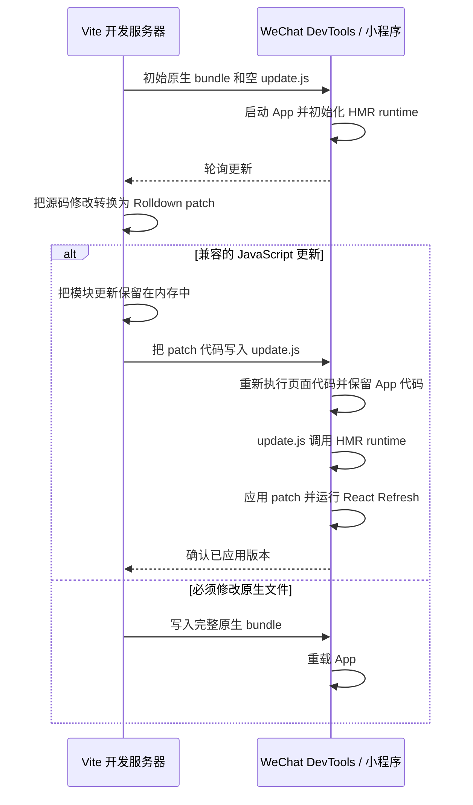

# 微信小程序 HMR 架构

## 问题

Web HMR 假设运行中的应用可以接收新的 JavaScript，并直接在原环境中执行。微信小程序不具备这个能力：

- 可执行代码必须来自项目文件，并由 WeChat DevTools 编译；
- 通过 `wx.request` 收到的代码不能用 `eval`、`Function` 或类似机制执行；
- DevTools 会根据发生变化的文件决定重载范围；
- 如果 DevTools 重载 App，原有的 JavaScript 堆、Taro root 和 React Fiber tree 都会丢失。

React Refresh 只能在现有 Fiber tree 仍然存活时保留状态。因此，核心问题是如何交付并执行新的模块代码，同时**不让 DevTools 重新执行 App**。

## 微信的关键行为

如果一个预先存在的 JavaScript 文件是页面的直接静态依赖，它会形成一个有用的重载边界：

- 该依赖变化时，DevTools 会重新编译并执行页面代码；
- `app.js` 不会重新执行；
- 现有 JavaScript 状态仍然可用。

这为 HMR 留出了空间。页面代码可以重新执行，而 HMR runtime、模块注册表、Taro root 和 Fiber tree 会因为 App 代码没有重新执行而继续存在。

插件为此保留了一个页面直接依赖：`update.js`。开发环境首次启动时这个文件是空的。每次出现兼容的 JavaScript 修改，开发服务器都会把生成的 patch 代码放进同一个文件。对 DevTools 来说，变化的始终只是这个已知的页面依赖。

DevTools 重新执行页面时，会在页面常规初始化之前执行 `update.js`。该文件调用已经存在的 HMR runtime，由它应用 patch。之后页面入口的其余代码继续执行；HMR runtime 会继续使用 patch 后的模块 exports，并确保页面只注册一次。

核心设计可以概括为：

> 把任意兼容的源码修改转换为一个页面级可执行文件的变化，让微信只重新执行页面，同时保留 App 和 React 状态。

每次兼容更新都**只会写入 `update.js` 这一个项目文件**。更新后的模块代码和 patch 历史保留在开发服务器内存中；`app.js`、页面 bundle、共享 chunk 和原生文件都不会被改写。服务器只把当前缺少的 patch 范围写入 `update.js`。因此 DevTools 只能观察到这个已知页面依赖发生变化，不会因为其他文件变化而触发 App 重载。

## 架构

双方通过两个通道协作：

- **控制通道**使用 `wx.request` 交换 build、session 和 version 元数据，不传输可执行源码。
- **执行通道**就是 `update.js` 文件。开发服务器把 JavaScript 写入项目，DevTools 再通过小程序的正常工具链编译它。

控制通道决定缺少哪些 patch；执行通道负责真正运行这些 patch。

## 为什么需要控制通道

`update.js` 文件是单向的执行机制。写入这个文件只能让 DevTools 知道项目文件发生了变化，却不能告诉开发服务器 DevTools 是否观察到这次变化、patch 是否执行完成，以及 HMR runtime 当前处于哪个版本。

如果没有反馈，服务器可能在前一个 patch 执行前就用新 patch 覆盖 `update.js`。文件事件被遗漏或合并时，更新也可能静默丢失。App 重载后，服务器还需要识别新的 HMR 客户端，并判断应该重放哪些 patch。

控制通道补全了这个反馈闭环。HMR 客户端可以通过它：

- 标识当前 build ID 和 session；
- 报告真正完成 React Refresh 的最后版本；
- 让服务器只发布连续缺失的 patch 范围；
- 在代码执行完成后确认，而不是在文件写入后确认；
- 漏掉更新时继续报告旧版本，让服务器重新发布。

选择 HTTP 是因为小程序可以使用 `wx.request`，而 Vite 开发服务器本身已经提供本地 HTTP 服务。HMR 元数据量很小，long polling 已经足够。控制通道不执行代码，也不需要 WebSocket；可执行 patch 代码仍然只通过 `update.js` 交付。

## 初始开发构建

开发模式使用一个 eager 的 Vite/Rolldown 模块图。同一个模块图既生成初始完整原生 bundle，也生成后续所有 patch。这样完整 bundle 与 patch 之间的模块 ID、transform、依赖边界和 React Refresh instrumentation 都保持一致。

初始输出需要建立三个条件：

1. App 启动 HMR runtime 和控制客户端。
2. 每个页面都直接静态依赖空的 `update.js` 文件。
3. 所有已配置的页面组件都提前初始化。

第三点用于支持尚未打开的路由。Patch 可能修改一个从未访问过的页面。提前初始化可以让该页面的模块先进入活动模块注册表，因此 patch 能立即应用，并在之后打开路由时继续生效。这个过程不会创建原生页面实例。

## 兼容更新流程

对于一次兼容的源码修改：

1. Rolldown DevEngine 根据现有开发模块图生成 patch。
2. 服务器确认这个 patch 不需要修改 WXSS、WXML、JSON 或资源等原生文件。
3. Patch 被转换为微信可接受的 JavaScript 语法。
4. 服务器为它分配下一个版本，并保存在内存中。
5. 客户端通过控制通道报告当前版本。
6. 服务器把客户端缺少的连续 patch 范围写入 `update.js`。
7. DevTools 发现页面依赖变化，只重新执行当前页面代码，不重新执行 App。
8. `update.js` 调用 HMR runtime，由它按顺序应用 patch。
9. React Refresh 使用保留下来的 Fiber tree 协调新的组件实现。
10. 只有 Refresh 完成后，客户端才确认新版本。

无论修改来自 App 组件、当前页面、未打开的页面还是共享依赖，都遵循同一条兼容更新路径。

## HMR runtime

由于 App 代码没有重新执行，HMR runtime 可以跨页面重新执行继续存在。它有三个主要职责。

### 应用 Rolldown patch

HMR runtime 持有活动模块注册表、当前 exports、hot contexts 和 HMR 边界。Patch 直接更新这份注册表，而不是加载第二份应用。

Runtime 还会记录由 patch 初始化的模块。DevTools 继续执行页面原有 bundle 时，原 bundle 中的 initializer 不能覆盖刚刚更新的模块。遇到这种情况，initializer 会返回当前 patch 后的 exports。

因此执行顺序是安全的：

- `update.js` 先安装新的模块实现；
- 剩余页面代码继续执行；
- 原 bundle 中的旧初始化不能覆盖新实现。

### 保留 React 状态

HMR runtime 使用 Vite 官方的 React Refresh runtime。Rolldown 更新模块 exports 并触发 HMR 边界，React Refresh 判断受影响的组件能否兼容更新。

对于 React Refresh 判断为兼容的组件更新，React 会复用现有 Fiber tree 和组件状态。Fiber tree 不会被序列化进 `update.js`，也不会复制到 patch 中。它只是因为 App 代码和 Taro root 没有被销毁而继续可达。

如果某个组件无法安全刷新，当前路由会重新启动。状态保留只适用于 React Refresh 认为兼容的更新。

### 让页面重新执行不破坏状态

页面入口属于原生集成代码，可能再次执行。HMR runtime 把它视为重复的集成初始化，并处理其中的重复执行副作用。

重新执行会受到保护，避免它：

- 重复注册同一个原生路由；
- 恢复原 bundle 中的旧模块实现；
- 用旧注册覆盖新的 React Refresh 注册；
- 断开已经保留的 Taro/React root。

更新完成后，原生页面 context 会重新连接到保留的 root。微信产生的页面侧附带行为会在这个重连过程中被过滤，但这只是实现细节，并不是 HMR 架构成立的基础。

## 可靠交付 patch

文件系统通知、HTTP 响应、页面重新执行和 React Refresh 并不构成一个原子操作。因此协议使用版本号，而不是假设事件会按固定顺序到达。

服务器记录：

- 当前完整构建的 **build ID**；
- 单调递增的 **patch version**；
- 该完整构建之后保留的 patch；
- 当前 HMR 客户端 **session**；
- 最多一个等待确认的已发布 patch 范围。

客户端持续报告已经实际应用的版本。如果客户端落后，服务器会把一段连续缺失的 patch 写入 `update.js`。该范围确认之前到达的新修改，会等待下一次发布。

文件写入成功不等于更新成功。客户端只有在 patch 执行和 React Refresh 完成后才会确认。如果 DevTools 漏掉文件事件，客户端会继续报告旧版本，服务器则使用不同的文件内容重新发布同一范围。如果同一批更新被观察两次，版本检查会阻止重复应用。

这个 stop-and-wait 模型优先保证正确性，而不是吞吐量。HMR 更新通常很小且由交互触发，但乱序执行或错误确认可能破坏活动模块图。

## 重启与重放

### HMR 客户端重启

开发服务器仍在运行时，DevTools 可能会重载 App。新的 HMR 客户端会创建新 session，并从版本 0 开始。服务器随后重新发布当前完整构建以来保留的所有 patch。

提前初始化页面可以确保这些 patch 被正确重放，包括重载后尚未打开的路由。

### 开发服务器重启

Patch 历史只保存在服务器内存中。Vite 重启后会执行新的完整构建并创建新的 build ID。最新源码已经包含在这个 bundle 中，因此旧 patch 历史既不需要，也不应继续信任。

新的完整构建会把 `update.js` 和 patch version 重置为 0。

### 有界历史

保留的 patch 历史有容量上限。历史过大时，服务器会执行新的完整构建并清除旧历史，避免长时间开发后积累无限增长的重放日志。

## 完整构建边界

只有能够表示为安全 JavaScript patch 的更新才走状态保留路径。如果修改涉及或可能涉及以下内容，就必须进行完整原生构建：

- WXSS 或新增的 Tailwind utilities；
- WXML、JSON、项目配置或页面配置；
- 导入资源或 public 文件；
- Rolldown 无法关联到有效 HMR 边界的输出；
- 无法安全协调的协议状态；
- 执行时抛出异常的 patch。

完整构建可能重载 App，因此不保证保留 React 状态。

这不只是保守策略。一旦 DevTools 选择 App 级重载，旧 JavaScript 堆和 Fiber tree 已经消失，之后的 HMR 逻辑无法恢复它们。

## 为什么这个设计是必要的

这个设计直接来自平台约束：

1. 新代码不能从网络直接执行，因此必须由 DevTools 编译项目文件。
2. React 状态无法跨 App 重载保留，因此变化文件必须触发仅页面重新执行。
3. 该文件必须从初始构建开始就是页面的直接静态依赖，否则 DevTools 无法足够早地建立所需重载边界。
4. HMR runtime 必须继续存在，才能在页面重新执行时应用 patch。

因此，固定的 `update.js` 文件不是任意选择的传输方式，而是同时满足“执行新代码”和“保持当前 App 不变”的最小机制。

## 为什么这个设计是充分的

对于兼容更新，所需条件都会成立：

1. DevTools 从 `update.js` 编译 patch 代码。
2. 只有页面代码重新执行，App 代码和已有 JavaScript 状态保持不变。
3. HMR runtime 把 patch 应用到现有模块注册表。
4. 页面重新执行保护机制阻止原 bundle 中的代码撤销 patch。
5. React Refresh 使用保留的 Fiber tree 完成协调。
6. 基于版本的确认保证 patch 始终作为一个有序前缀应用。

只要其中任何条件无法保证，就改用完整构建。

## 为什么更简单的方案不可行

### 通过 HTTP 或 WebSocket 发送源码

小程序可以接收源码文本，但不能在不使用受限动态代码机制的前提下执行它。控制通道只能传元数据，不能传 patch。

### 重写原始输出文件

修改任意 JavaScript 或原生输出文件，会让 DevTools 有机会重载 App，从而销毁 HMR 需要保留的状态。

### 动态或间接导入更新

如果页面已经开始重新执行后才发现依赖，就无法及时建立安全重载边界。`update.js` 必须在初始 bundle 中就作为页面的直接静态依赖存在。

### 重载后重建应用状态

序列化部分值并不等于保留活动的 React Fiber tree、hook state、原生输入状态、模块图和 Taro root。这个架构选择让这些对象继续存在，而不是尝试重建它们。

## 保证与限制

对于兼容的 JavaScript 更新，该架构旨在保留：

- 当前 App 和已有 JavaScript 状态；
- 当前路由和原生页面状态；
- Taro root；
- 原生输入状态；
- React Refresh 判断为兼容的组件状态。

它不保证保留：

- 任意模块局部 singleton 状态；
- React Refresh 无法兼容更新的组件状态；
- 完整原生构建前后的状态；
- 开发服务器重启前后的状态。

关于页面直接依赖要求的 DevTools 实验记录见 `draft/hmr-probe-result.md`。
