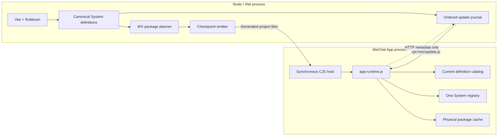

# SystemJS Architecture for the WeChat Target

## Status and authority

This document defines the planned JavaScript module, package-loading, and development-update architecture for the
WeChat target. It is based on the probes and conclusions recorded in
[`systemjs-probe-result.md`](./systemjs-probe-result.md).

Where this document conflicts with the current WX CommonJS or finalized-Rolldown-patch descriptions in
[`core-architecture.md`](./core-architecture.md) or [`hmr-architecture.md`](./hmr-architecture.md), this document is
the intended replacement. The native hot-reload boundary established by [`hmr-probe-result.md`](./hmr-probe-result.md)
remains valid and is reused; the payload applied through that boundary changes from finalized Rolldown patches to
ordered System-definition transactions.

The architecture is validated by isolated compiler, loader, planner, graph, and DevTools probes. Integration into the
published plugin remains implementation work.

## Goal

Ordinary application code must work without WX-specific import APIs or package configuration:

```tsx
const Heavy = React.lazy(() => import('./Heavy'));
```

The same requirement applies to direct dynamic imports, nested dynamic imports, Vite-supported variable imports, and
`import.meta.glob`. Vite and Rolldown must continue to own resolution, source transforms, tree shaking, CommonJS
interop, dynamic-entry discovery, shared-code decisions, and production optimization.

The WX-specific layer owns only the concerns Vite does not model:

- representing application modules in a linker that can cross native package boundaries;
- assigning logical definitions to legal physical Mini Program packages;
- loading generated packages through statically discoverable `require.async()` calls;
- preserving one evaluated application graph across lazy loading and hot updates;
- delivering executable development updates through a DevTools-compiled project file.

The resulting model is:

> Vite and Rolldown produce canonical System definitions; the WX plugin places those definitions into legal physical
> packages; `app-runtime.js` owns their one evaluated System graph; and development advances that graph through ordered
> definition transactions.

## Scope

The first milestone includes:

- ordinary `import()` in WX application modules;
- `React.lazy` for components and modules;
- nested dynamic imports;
- Vite-supported variable imports and lazy glob imports;
- nonduplicated shared async code;
- automatic main/subpackage placement;
- development and production compilation;
- live ESM bindings, reexports, cycles, CommonJS interop, and top-level await;
- ordered pure-JavaScript topology updates;
- integration with the existing page-scoped HMR execution boundary;
- React Refresh and retained Taro roots after the System transaction is applied.

The first milestone does not include:

- lazy native pages;
- independent Mini Program packages;
- native `componentPlaceholder` orchestration;
- remote JavaScript delivery or evaluation;
- lazy CSS ownership;
- native Skyline hot reload;
- a user-facing async-package configuration API.

Configured App and page components remain static roots in main. Only ordinary dynamic-import boundaries below those
roots create generated async packages.

## Platform constraints

The architecture follows several non-negotiable WeChat constraints.

### Native registration is synchronous

`app.js` and every native page entry must call `App(...)` or `Page(...)` synchronously. They cannot wait for
`System.import()` or `require.async()` before registering.

The native files therefore remain stable CommonJS shells. They bind synchronous native registration to stable runtime
root handles. User application modules behind those handles use System registrations.

### Cross-package CommonJS is restricted

A package download does not make arbitrary cross-package synchronous `require()` legal. Package A must not download
package Shared and then call `require('../Shared/module.js')`.

Every synchronous `require()` emitted inside a generated package is package-local. Logical cross-package application
edges are linked by SystemJS from the registration tuples returned by package resolvers.

### Async targets must be statically discoverable

The WeChat compiler does not reliably include a module addressed only by a variable call:

```js
require.async(entryPath);
```

Each checkpoint therefore contains a generated literal dispatcher:

```js
function loadPhysicalPackage(packageId) {
    switch (packageId) {
        case '__vpt_async_a':
            return require.async('./__vpt_async_a/index.js');
        case '__vpt_async_b':
            return require.async('./__vpt_async_b/index.js');
        default:
            return Promise.reject(new Error(`Unknown package ${packageId}`));
    }
}
```

The generic runtime calls this dispatcher by package ID. A placement change modifies the dispatcher and requires a new
checkpoint.

### Executable development code must pass through DevTools

Code received through `wx.request` cannot be executed through `eval`, `Function`, a data URL, or an equivalent dynamic
code path. HTTP carries control metadata only.

Executable hot definitions are written to the fixed `vpt-hmr/update.js` project file. DevTools compiles that file and
reruns the page-side boundary while retaining the App heap.

### Package limits apply to physical output

The planner and final emitter must account for:

- a 2 MiB hard limit for main;
- a 2 MiB hard limit for every subpackage;
- a soft planning target below the hard limit, initially about 1.8 MiB;
- the practical DevTools/compiler ceiling of 100 `app.json.subPackages` entries, shared by user and generated packages;
- the applicable whole-project limit, generally 30 MiB or 20 MiB for service-provider-developed Mini Programs.

The 100-package value is a practical tooling limit rather than a numerical limit currently stated in public WeChat
documentation.

### Base-library support

The generated transport requires `require.async()`, so the minimum supported base library is 2.11.2. The runtime may
use `wx.onLazyLoadError` as additional diagnostics on base library 2.24.3 or newer, but correctness cannot depend on that
optional callback.

## Architectural invariants

The implementation must preserve these invariants.

1. **One evaluated application graph.** SystemJS is the only owner of evaluated application namespaces.
2. **One application representation.** Initial, lazy, shared, and hot application code uses genuine System
   registrations.
3. **Stable native host.** Native App, Page, recursive component, runtime, dispatcher, and update shells remain
   CommonJS platform files.
4. **Vite owns module semantics.** The plugin does not rediscover source imports, recognize `React.lazy`, implement
   CommonJS interop, or invent another tree shaker.
5. **Logical and physical identity are separate.** A canonical module ID never encodes its generated package path.
6. **No cross-package application `require()`.** Package entries use synchronous `require()` only for files inside their
   own root.
7. **No remote code evaluation.** Network responses never contain executable application source.
8. **Main ownership wins.** Anything in the static App/page closure stays in main even when lazy code also consumes it.
9. **Physical placement is frozen within a checkpoint epoch.** Pure-JavaScript hot topology advances through in-memory
   definitions rather than rewriting package layout.
10. **Updates form one ordered prefix.** A runtime state is one checkpoint plus revisions `1..N`, never an arbitrary set
    of deltas.
11. **H5 is unchanged.** This architecture is isolated to the WX target.

## System overview

There are two long-lived owners in different processes.



The Node side owns code production and physical files. The WeChat side owns current evaluated state. They do not share
objects or call each other directly.

## Terminology

### Logical definition

A logical definition is one independently addressable System registration.

- In development, it normally corresponds to one retained source module from Rolldown `preserveModules` output.
- In production, it corresponds to one optimized Rolldown chunk.

A logical definition is not necessarily a source file, a native file, or a physical subpackage.

### Physical package

A physical package is a WeChat download and size-accounting container. It can contain many unrelated logical
definitions. Downloading it does not execute every definition in it.

### Checkpoint

A checkpoint is a complete native project state with a new build ID. It contains all current definitions, placement,
native files, and an empty update file at revision zero.

### Definition update

A definition update advances one checkpoint epoch by one revision. It upserts and removes current logical definitions
without changing physical placement files.

### Definition catalog

The catalog stores the current registration provider and topology for each canonical ID. It contains code metadata, not
a second set of evaluated module namespaces. Only SystemJS evaluates registrations.

## Shared logical contract

The central build/runtime artifact is deliberately small:

```ts
type ModuleId = string;

type ModuleDefinition<TRegistration> = Readonly<{
    id: ModuleId;
    staticDependencies: readonly ModuleId[];
    dynamicDependencies: readonly ModuleId[];
    registration: TRegistration;
}>;
```

The Node representation uses a generated JavaScript expression or file source for `registration`. The WeChat
representation is the registration tuple returned by a locally compiled CommonJS registration file.

Physical location, package root, revision, and HMR boundary do not belong to the logical definition itself.

The registration tuple has normal System semantics:

```ts
type SystemRegistration = readonly [
    dependencies: readonly ModuleId[],
    declare: (
        exportValue: SystemExport,
        context: SystemContext
    ) => {
        setters?: readonly ((namespace: Record<string, unknown>) => void)[];
        execute?: () => void | Promise<void>;
    },
    dependencyMetadata?: readonly unknown[]
];
```

The registration dependency order is semantically significant and must not be sorted merely for deterministic output.

## Canonical module IDs

Canonical IDs are build-scoped logical addresses. They are not native paths.

Representative development IDs are:

```text
vpt:/module/src/components/Heavy.tsx
vpt:/module/@virtual/vite-preload-helper
```

Representative production IDs are:

```text
vpt:/chunk/app-<hash>.js
vpt:/chunk/shared-<hash>.js
```

The canonicalizer must:

- normalize path separators;
- preserve semantically relevant Vite query identity;
- distinguish virtual modules;
- remove absolute filesystem paths from runtime edges;
- map every emitted static import to the target definition ID;
- map every emitted dynamic import to the target definition ID;
- fail the build when an effective runtime import cannot be resolved to a known definition.

IDs need to remain stable for the lifetime of one development checkpoint. A new checkpoint may establish a new ID
space because its build ID prevents old updates from being mixed with it.

The compiler rewrites emitted edges, not application source. Source still contains ordinary imports.

## Compiler architecture

### One pipeline with mode-specific granularity

Development and production use one conceptual pipeline:

```text
source
    -> Vite transforms and React instrumentation
    -> Rolldown output units
    -> WX preload normalization
    -> canonical dependency IDs
    -> dynamic-import and System transform
    -> ModuleDefinition values
```

Only the Rolldown output granularity changes.

```text
development: preserveModules source unit -> System definition
production:  optimized code-split chunk  -> System definition
```

This is the same distinction Vite normally makes between module-oriented development and bundle-oriented production.
Using `preserveModules` in production would lose scope hoisting and chunk optimization. Using production chunks as the
development replacement unit would make updates broad and unstable.

### Vite and Rolldown ownership

The compiler consumes emitted Rolldown metadata such as:

- `facadeModuleId`;
- `moduleIds`;
- `imports`;
- `dynamicImports`;
- entry and dynamic-entry flags;
- emitted code and byte estimates.

It does not scan source to infer lazy boundaries. Vite has already expanded supported variable imports and glob imports,
and Rolldown has already chosen reachable modules and production sharing.

CommonJS is lowered by Vite and Rolldown before the System transform. The runtime therefore consumes Rolldown's actual
interop result and does not maintain a separate `require` compatibility graph.

### Development output

Development configures Rolldown to retain module-level output units. Entry signatures consumed by the native runtime
must be externally observable:

```ts
preserveEntrySignatures: 'strict'
```

Without this setting, Rolldown can correctly conclude that an exported root or dynamic-import function has no ESM
consumer and remove it.

Development definitions use stable source-oriented IDs and are hashed after canonical normalization. Incremental output
updates the current definition map; only changed definitions enter the ordered log.

### Production output

Production retains normal Rolldown code splitting. Dynamic entries and shared chunks remain Rolldown decisions. Each
resulting chunk becomes one System definition.

The package planner operates on this chunk-level graph. It does not reconstruct source-level cycles hidden inside a
scope-hoisted production chunk.

### Vite preload normalization

Vite's browser preload helper has no role in WeChat package loading. Replacing its implementation with a no-op is not
enough: the wrapper call, helper import, and generated dependency metadata can still change import order and produce
false HMR diffs.

Before the System transform, the compiler must:

1. replace `__vitePreload(() => import(target), metadata, ...)` with the direct loader expression;
2. remove the preload-helper import;
3. omit the now-unreachable preload-helper logical definition;
4. derive topology from the normalized registration graph.

The transformation must preserve evaluation semantics and dynamic target identity.

### System transform

The normalized ESM output is converted to genuine System registrations. The proven route uses Babel's dynamic-import
and System module transforms, as used by Vite's legacy plugin architecture.

This step is responsible for lowering live export mutations to `_export(...)` calls, preserving reexports, cycles,
dynamic import, and top-level await. It must run after Rolldown's CommonJS and chunk transforms so generated namespace
semantics remain intact.

A future native Rolldown System output mode could replace the Babel step, but it must produce the same logical contract.

### Registration files

The emitter writes registrations as local JavaScript files compiled by DevTools. A file exports a registration tuple,
either directly or through a local capture of one generated `System.register(...)` call.

This is static project code. The runtime does not parse or evaluate registration source text.

## Native host and main graph

The WX output has two JavaScript layers.

### Stable CommonJS host

The following remain native platform shells:

```text
app.js
pages/*/index.js
comp.js
app-runtime.js
vpt-system-core.js
vpt-package-loaders.js
vpt-hmr/update.js
```

They initialize the Mini Program environment, synchronously call `App(...)` or `Page(...)`, expose package-local
resolvers, and connect Taro's native integration to stable runtime handles.

### System application graph

User App, page, component, utility, and dependency code uses System definitions. Configured App and page roots and their
static closures belong to main. They are not lazy pages and do not trigger generated package loading.

The native page shell can register synchronously because it registers a stable generic Taro page configuration. That
configuration points at the main runtime root for the configured page. Main definitions are bootstrapped from local
registration files; ordinary dynamic imports below the page root remain asynchronous.

The relevant split is:

```text
main
    native App/Page shells
    app-runtime and embedded System core
    App and configured page System roots
    every static dependency reachable from those roots

async packages
    definitions reachable only through ordinary dynamic imports
```

`React.lazy` is therefore not special to the compiler:

```text
React.lazy(() => import('./Heavy'))
    -> normal dynamic-import definition edge
    -> app-runtime System import
    -> package transport if Heavy is not in main
```

## Physical package planning

### Planner responsibility

The package planner assigns already-compiled logical definitions to main or generated package roots. It is not a
JavaScript bundler. It does not combine lexical scopes, resolve imports, tree-shake, or create shared chunks.

Its input is logical topology and estimated emitted bytes:

```ts
type PlanningModule = Readonly<{
    id: ModuleId;
    staticDependencies: readonly ModuleId[];
    dynamicDependencies: readonly ModuleId[];
    byteLength: number;
}>;
```

Its output is a placement map plus package diagnostics.

### Static SCC graph

Planning begins by collapsing static cycles into strongly connected components. The implementation uses iterative graph
traversal so deeply generated graphs do not depend on the JavaScript call-stack limit.

```text
logical static graph
    -> iterative SCC discovery
    -> condensation DAG
```

Development SCCs contain source-module definitions. Production SCCs contain optimized chunk definitions.

An SCC is a soft affinity atom: if it fits under the hard package limit, the planner keeps it together. This reduces
package coordination but is not required for correctness.

### Main closure

The planner computes main first:

```text
main = static closure of all configured App and page entry definitions
```

Anything in this closure remains in main. If lazy code also consumes it, lazy code links back to the main definition.
Main ownership cannot be traded for package-count reduction.

If exact main output exceeds 2 MiB, placement cannot repair it by turning a static root edge into an async edge. The
build must reduce or explicitly redesign the synchronous root.

### Dynamic demand

Every non-main dynamic target SCC receives a unique demand bit. Demand bits propagate from each boundary SCC through
static dependency edges over the condensed DAG.

For this graph:

```text
entry
    -> dynamic A
    -> dynamic B

A ----\
       -> Shared
B ----/
```

the demand sets are:

```text
A      {A}
B      {B}
Shared {A, B}
```

BigInt-backed demand keys avoid fixed 32- or 64-boundary limits. This matters for generated route groups and large
`import.meta.glob` expansions.

SCCs with identical demand sets form initial affinity groups.

### Splitting and merging

The normal package target is below the hard limit, initially about 1.8 MiB. Initial groups are packed using exact or
conservative definition-size estimates.

The planner may merge bins when combined size remains safe and estimated overfetch is cheap:

```text
overfetch =
    left.bytes  * consumersOnlyInRight +
    right.bytes * consumersOnlyInLeft
```

This lets tiny unrelated definitions share one physical download without changing logical execution. Large unrelated
features remain separate when merge cost is high.

If an async SCC exceeds 2 MiB but contains multiple logical definitions, it may be split across physical packages.
SystemJS still links the one logical SCC. If one logical definition alone exceeds 2 MiB, the placer cannot split it; the
compiler must request a different Rolldown chunk plan or fail with a diagnostic.

### Package count and existing packages

User-defined and generated subpackages share the practical 100-entry ceiling:

```text
available generated packages = 100 - existing subPackages.length
```

The planner may perform additional legal merges under count pressure. If no merge fits under the hard size limit, it
fails instead of emitting an invalid project.

Generated roots derive from sorted logical IDs and use deterministic collision repair against existing user roots.
Equivalent graph and size input must produce the same roots regardless of iteration order.

### Exact measurement and repair

Estimated registration bytes are not the final Mini Program package size. Resolver code, the literal dispatcher,
native files, JSON, WXML, WXSS, source maps, and assets also contribute.

After emission, the build must measure every physical package exactly. A bounded repair loop may repartition async
definitions and re-emit. It must never:

- move part of the static main closure into an async package;
- duplicate a logical definition to hide overflow;
- exceed the package count limit;
- accept an individually oversized definition.

A failure after bounded repair produces a package-specific diagnostic with the largest contributing files and suggested
compiler-level remedies.

## Physical output and resolvers

A representative checkpoint layout is:

```text
app.js
app.json
app-runtime.js
vpt-system-core.js
vpt-module-manifest.js
vpt-main-resolver.js
vpt-package-loaders.js
vpt-hmr/update.js

pages/index/index.js
pages/index/index.json
pages/index/index.wxml

vpt-main-modules/
    modules/*.js

__vpt_async_ab12cd34/
    index.js
    modules/*.js

__vpt_async_ef56ab78/
    index.js
    modules/*.js
```

The exact names are implementation details, but ownership is not.

### Main resolver

The main resolver synchronously returns main registration tuples through local literal `require()` calls.

### Package-local resolver

Every generated package exports one CommonJS resolver:

```js
module.exports = {
    get(id) {
        switch (id) {
            case 'vpt:/module/src/Heavy.tsx':
                return require('./modules/0.js');
            case 'vpt:/module/src/heavy-helper.ts':
                return require('./modules/1.js');
        }
    }
};
```

All requires above stay inside the package root. Requiring a registration file constructs or returns its registration
tuple; it does not execute the application module body.

### Literal package dispatcher

The root dispatcher contains one literal `require.async()` per generated package. The package plan, dispatcher, package
roots, and `app.json.subPackages` are emitted as one atomic checkpoint.

Generated JavaScript-only packages use:

```json
{
    "root": "__vpt_async_ab12cd34",
    "pages": []
}
```

This shape is validated in the simulator but still requires preview, upload, and real-device coverage.

## App runtime architecture

`app-runtime.js` is the sole owner of application loading and evaluation in WeChat.

Internally it contains four concepts, not four public runtimes:

1. the current definition catalog;
2. the placement and static-topology manifest;
3. the physical package Promise cache;
4. one embedded System registry.

### Embedded System core

The runtime embeds the System core needed for registration linking, live bindings, cycles, dynamic import, and top-level
await. Browser script loading, fetch loading, import maps, and remote resolution are omitted.

`resolve()` accepts canonical IDs. `instantiate()` obtains registration tuples from the current catalog and physical
resolvers. SystemJS never constructs a native relative package path.

### Importer-aware bookkeeping

Fine-grained SCC replacement needs to distinguish setters owned by invalidated modules from setters owned by stable
boundaries. The embedded core therefore records importer identity:

```text
before:
    dependency.importers.push(setter)

after:
    dependency.importers.push({ importer: currentLoad, setter })
```

System export propagation invokes `record.setter(namespace)`.

This is a narrow loader capability required for deletion and relinking. It does not create another namespace graph.
The embedded System registry remains the owner of evaluated module state.

### Catalog lookup priority

For a canonical ID, the current catalog resolves one provider:

1. a hot definition installed after the checkpoint, when present;
2. otherwise the checkpoint's main or package registration provider.

The catalog stores only the current provider. Historical revisions stay in the server's bounded update log, not as
cumulative runtime snapshots.

### Import preparation

Before System evaluates a target, the runtime computes its static physical package closure from manifest topology:

```ts
async function prepare(moduleId: ModuleId) {
    const packageIds = staticPackageClosure(moduleId, manifest);
    await Promise.all(packageIds.map(loadPackage));
}
```

`instantiate()` performs this preparation so imports originating from `_context.import()` receive the same behavior as
imports initiated by native integration code.

Prefetching package resolvers is semantically safe because registration `execute()` bodies have not run. It prevents a
deep static graph from becoming one serialized package-download waterfall.

### Package loading

The package cache stores the in-flight Promise immediately:

```ts
function loadPackage(packageId: string) {
    const existing = packagePromises.get(packageId);
    if (existing) return existing;

    const promise = literalDispatcher(packageId).then(readPackageResolver);
    packagePromises.set(packageId, promise);

    promise.catch(() => {
        if (packagePromises.get(packageId) === promise) {
            packagePromises.delete(packageId);
        }
    });

    return promise;
}
```

This guarantees:

- one transport call for concurrent consumers;
- stable successful package handles;
- retry after a rejected load;
- no duplicate definition execution;
- stable System namespace identity.

The package boundary accepts either a direct CommonJS resolver or an ESM-style `default` wrapper. This normalization is
restricted to package entries. Application namespaces remain genuine System namespaces.

### Cross-package cycles

A static SCC may span packages:

```text
package P1: A, B
package P2: C

logical graph: A -> B -> C -> A
```

The runtime downloads P1 and P2, obtains registration tuples, and lets System create one load record for each canonical
ID. Package code never synchronously requires the other package. System closes and executes the cycle according to ESM
semantics.

## Development compilation

Development uses the same logical contract with source-module granularity.

The Vite-side integration must produce normalized definitions from the incremental bundled-development lifecycle. It
maintains the current definition hash and topology map and emits one ordered delta when that state changes.

The implementation may consume Rolldown's HMR analysis for accepted-boundary metadata, but it does not execute or ship
Rolldown's finalized patch JavaScript. A finalized patch's getter holder cannot preserve later mutable export updates in
a System graph.

The compiler adapter must therefore provide, for each revision:

- new or changed genuine System definitions;
- removed canonical IDs;
- old and new static/dynamic topology;
- accepted HMR boundaries selected through Vite/Rolldown semantics;
- diagnostics for native output affected by the same source edit.

The implementation should use incremental output rather than repeatedly materializing complete snapshots. Repeated
snapshot comparison was a probe technique, not the target server architecture.

## Ordered System-definition HMR

### Update contract

A development update is conceptually:

```ts
type HotBoundary = Readonly<{
    boundary: ModuleId;
    acceptedVia?: ModuleId;
}>;

type ModuleUpdate<TRegistration> = Readonly<{
    buildId: string;
    fromRevision: number;
    toRevision: number;
    upsert: readonly ModuleDefinition<TRegistration>[];
    remove: readonly ModuleId[];
    boundaries: readonly HotBoundary[];
}>;
```

A batch contains a contiguous ordered sequence of these transactions. The server representation contains generated
registration source for `update.js`; the runtime receives actual registration tuples after DevTools compilation.

### Why finalized Rolldown patches are not used

Executing a finalized Rolldown patch and publishing its current getter holder can replace a constant export once. It
cannot preserve a later mutation because the Rolldown initializer does not call System `_export()`.

Repairing that gap would require another ESM assignment and reexport transform in the runtime. The architecture instead
uses genuine System registrations for initial, lazy, and hot code.

There is no `createEsmInitializer`, `createCjsInitializer`, `registerModule`, or `loadExports` application runtime in
WeChat.

### Affected-set computation

Before mutating the evaluated graph, the runtime builds a transaction view from the union of old and new static
topology:

```text
changed and removed loaded definitions
    -> expand their static SCCs
    -> walk reverse static edges
    -> stop at accepted boundaries
```

The union matters when an update removes an edge: old topology identifies stale importer records that must be detached,
while new topology determines the graph to reinstantiate.

Unloaded upserts do not enter the affected set. They replace the catalog provider and remain unevaluated.

### Relinking transaction

The transaction order is:

1. Validate build ID and contiguous revision before changing catalog or registry state.
2. Synchronously begin page-rerun and native-lifecycle protection.
3. Construct and validate the next catalog and topology.
4. Compute the affected loaded set from old/new topology and accepted boundaries.
5. Run hot-dispose callbacks for affected loaded modules.
6. Delete affected System load records.
7. Discard importer setters owned by affected records.
8. Retain importer setters owned by stable external boundaries.
9. Install the next catalog.
10. Import the affected reload roots and await linking and top-level execution.
11. Reattach stable external setters to the new load records.
12. Invoke accepted hot callbacks.
13. Run React Refresh.
14. Reconnect the retained Taro root and finish page-rerun guards.
15. Advance the revision and acknowledge it to the server.

A revision is not acknowledged after file write, registration capture, or partial linking. Completion means the active
runtime graph and UI transaction have finished.

If the transaction throws after destructive graph mutation, the runtime requests a checkpoint rather than pretending
the old graph remains valid.

### Mutable exports and cycles

When one module inside a cycle changes, the affected set expands to its static SCC and then to nonaccepting importers.
Internal setters from the old SCC are discarded. New registrations reconstruct the SCC, and only stable external
setters are attached to it.

Because the new code is a genuine System registration, later assignments continue to call `_export()` and propagate
through the retained boundary.

### Topology changes

Pure-JavaScript topology changes are ordinary updates:

- adding or removing a static import;
- adding or removing a dynamic import;
- adding or deleting modules;
- changing sharing relationships;
- changing a cycle;
- introducing a new lazy boundary.

Physical checkpoint placement remains frozen. New or changed definitions live in the current hot catalog and are
available to future imports. On App restart, the server replays the ordered log before those definitions are needed.
The next checkpoint incorporates current topology into a new physical plan.

### Unloaded modules

A changed lazy definition that has never loaded is replaced only in the catalog. It is not evaluated for the sake of
HMR. Its first later import receives the newest registration.

Likewise, adding a new dynamic target installs code and topology without executing it. This preserves fresh-build
laziness and avoids side effects on inactive features.

### CommonJS and top-level await

CommonJS updates use Rolldown's lowered ESM result and ordinary System invalidation. The WX runtime does not implement a
second CJS namespace policy.

Relinking waits for asynchronous System `execute()` completion before reattaching boundaries and acknowledging the
revision. Replacing a module whose previous top-level-await execution is still pending needs an explicit policy. The
intended behavior is to queue behind the pending execution and fall back to a checkpoint on rejection or timeout; this
case remains to be integrated and validated.

## HMR execution and control transport

The existing DevTools boundary remains part of the design.

### Fixed execution file

Every generated page entry directly and literally requires the same pre-existing `vpt-hmr/update.js` file from the
initial checkpoint. During a JavaScript update, the server writes only this file.

DevTools recompiles and reruns page-side code while retaining the App heap. `update.js` calls the existing
`app-runtime.js` with the missing ordered definition range before ordinary page setup continues.

Page rerun guards ensure that repeated native integration code cannot:

- register a route twice;
- replace the current catalog with checkpoint definitions;
- overwrite current React Refresh registrations;
- detach the retained Taro root;
- acknowledge an update before it completes.

### Control channel

The runtime reports metadata through `wx.request`:

- build ID;
- client session ID;
- last fully applied revision.

HTTP never carries executable definitions. The server responds by waiting, requesting a checkpoint, or publishing the
missing contiguous range into `update.js`.

Only one range is in flight. A missed file event leaves the client on its old revision, so the server republishes the
same range with changed file content. Duplicate execution is rejected by revision checks.

### Checkpoint and bounded log

Development state is:

```text
full checkpoint at revision 0
    + ordered definition update 1
    + ordered definition update 2
    + ...
    + ordered definition update N
```

The server stores a bounded log, not cumulative overlay snapshots. A long-running session is compacted by creating a
new checkpoint and build ID from current source, resetting the log and `update.js`.

On an App/client restart within the same server epoch, the new runtime starts from the checkpoint and reports revision
zero. The server republishes retained updates in order. A Vite-server restart creates a new checkpoint; old history is
not persisted or trusted.

## React Refresh and Taro integration

The System transaction updates JavaScript semantics. React Refresh and native root retention remain a subsequent UI
transaction owned by the same `app-runtime.js`.

Vite's React transform runs before Rolldown output and the System transform. The System context supplies the hot metadata
required by the instrumented module. Accepted boundaries come from Vite/Rolldown HMR analysis rather than filename or
component-name heuristics.

The update order is:

```text
begin native update protection
    -> apply and relink System definitions
    -> invoke accepted boundaries
    -> perform React Refresh
    -> reconnect retained Taro root
    -> finish native lifecycle protection
    -> acknowledge revision
```

If React Refresh cannot preserve a component family, the runtime may remount the relevant route boundary while keeping
the App runtime alive. A native full build is not required merely because component state cannot be preserved.

The page component itself remains a static main root. Suspense is needed only for genuine dynamic imports such as
`React.lazy`, not as a mechanism for lazy native pages.

## Checkpoint boundary

A new checkpoint is required when output outside the hot definition catalog must change, including:

- `app.json`, page JSON, WXML, WXS, or project configuration;
- the placement manifest;
- generated package roots or package resolvers;
- the literal `require.async()` dispatcher;
- the embedded System core or `app-runtime.js` implementation;
- App or page native shell structure;
- current app-level WXSS output;
- imported assets or public files whose native output changes;
- exact package-size overflow that requires physical replanning;
- update-log compaction;
- an unrecoverable transaction or protocol error.

Pure-JavaScript logical topology does not require a checkpoint while the hot catalog and update log can represent it.
Physical placement may remain older than current logical topology until compaction.

## CSS and assets

The initial dynamic-import milestone keeps lazy-source CSS eager. Vite's CSS graph and existing companion-asset pipeline
continue to collect it into root `app.wxss`.

This avoids a second lazy style-ownership system but means:

- loading a lazy definition does not load separate WXSS;
- adding a new Tailwind candidate or changing source CSS can require rewriting `app.wxss`;
- rewriting `app.wxss` reloads the App in the tested DevTools environment and therefore creates a checkpoint/full-build
  boundary.

Bare probes show that direct page-owned `page.wxss` updates can preserve App and Page identity. Route-partitioned CSS can
use that boundary in a later design, but it is not part of this module architecture.

## H5 isolation

The H5 target retains normal Vite behavior:

- browser ESM in development;
- standard Vite dynamic import and preload behavior;
- normal production code splitting;
- browser React Fast Refresh;
- no System registration transform;
- no WX package planner;
- no `require.async()` dispatcher.

All SystemJS plugins, aliases, virtual modules, and runtime files must be gated to the WX target.

## Failure and recovery policy

### Build-time failures

The build fails with actionable diagnostics for:

- an unresolved effective dynamic import;
- a canonical dependency with no definition;
- duplicate canonical IDs;
- main overflow;
- an individually oversized logical definition;
- package-count exhaustion;
- total package overflow;
- a generated root collision that cannot be repaired;
- an illegal native output shape;
- a System transform whose dependency metadata disagrees with the registration.

### Runtime package failures

A rejected package Promise is removed from the cache and may be retried. The error includes package ID, package root,
requested module ID, and original `require.async()` failure when available.

A resolver that does not expose the requested canonical ID is a checkpoint corruption error rather than a normal
network retry.

### Runtime update failures

The runtime rejects stale build IDs, skipped revisions, duplicate revisions, and invalid topology before mutation.

After destructive mutation begins, any uncaught linking, execution, TLA, hot-callback, Refresh, or root-reconnection
failure requests a new checkpoint. The client does not acknowledge the failed revision.

## Performance model

The architecture avoids whole-generation replacement.

### Development compilation

Rolldown remains incremental. Only changed normalized definitions and topology enter a revision. The System transform
runs on changed output units rather than the entire source tree when the incremental API exposes them.

### Package loading

Static package closure prefetch starts independent downloads concurrently. In-flight Promise caching deduplicates
sibling imports and overlapping closures.

### Evaluation

System executes only definitions needed by the requested logical graph. Downloading a package containing several lazy
features does not execute every feature definition.

### HMR

Only the affected loaded SCCs and nonaccepting importers are reexecuted. Stable accepted roots and unrelated loaded
modules retain identity. Unloaded definitions are not initialized.

### Memory

The runtime retains:

- one current definition provider per canonical ID;
- one current System load record per evaluated ID;
- one Promise/resolver per successfully loaded physical package;
- hot-context data required by active modules.

It does not retain every historical definition generation or a second Rolldown namespace graph. The server, not the
client, owns bounded revision history.

## Security and compliance

The runtime executes only code compiled from local project files by Vite, Rolldown, Babel, and WeChat DevTools.

The architecture forbids:

- `eval`;
- `Function` construction;
- remote script URLs;
- JavaScript source transported over the control channel;
- data-URL or blob-style code execution;
- treating downloaded text as a registration.

`require.async()` addresses only files included in the generated Mini Program project through literal dispatcher cases.
Canonical IDs cannot be converted into arbitrary filesystem paths at runtime.

## Ownership boundaries

### Vite-side WX integration

The Node/Vite process owns:

- compiler-mode selection;
- preload normalization;
- canonical-ID assignment;
- System registration generation;
- current definition hashing and topology;
- automatic physical planning;
- exact package measurement and repair;
- checkpoint emission;
- incremental boundary extraction;
- the ordered update journal;
- HTTP control middleware;
- atomic `update.js` publication.

### `app-runtime.js`

The WeChat process owns:

- the embedded importer-aware System core;
- the current definition catalog;
- placement and topology manifests;
- package prefetch and Promise caching;
- System resolution and instantiation;
- hot contexts and disposal;
- ordered relinking transactions;
- React Refresh;
- native page-rerun protection;
- retained Taro roots;
- revision acknowledgement.

### Generated native shells

Generated CommonJS shells own only synchronous platform integration. They do not evaluate application source, decide
package placement, or implement a second module registry.

## Rejected alternatives

### Finalized Rolldown patch as the client format

Rejected because one-time getter publication loses future mutable-export updates. Repair would duplicate ESM lowering.

### A permanent Rolldown client runtime beside SystemJS

Rejected because it creates two evaluated namespace graphs with ambiguous identity, live bindings, cycles, and HMR
ownership.

### `preserveModules` in production

Rejected because it sacrifices scope hoisting, optimized shared chunks, file-count reduction, and production startup
performance.

### Production chunks as development replacement units

Rejected because a small source edit would replace broad chunks and reexecute unrelated code.

### Native cross-package `require()` after download

Rejected because package download does not legalize arbitrary synchronous cross-package CommonJS edges.

### Duplication as the general sharing strategy

Rejected because it changes singleton identity, side-effect count, live bindings, and cache behavior. The System linker
supports one shared definition instead.

### One subpackage per logical module

Rejected because physical packages are download bins and the practical count ceiling is shared with user packages.

### Variable `require.async()` paths

Rejected because DevTools does not discover those targets reliably. The emitter generates literal calls.

### Cumulative hot snapshots

Rejected because repeated edits can produce quadratic write volume and retain unnecessary old code. The protocol uses a
checkpoint plus bounded ordered deltas.

### Whole-System-generation replacement

Rejected because it relinks and reexecutes the entire active graph, increases transient memory, and loses the delta
performance model.

### Remote JavaScript transport

Rejected by Mini Program code-execution constraints and the project's security model.

## Migration from the current WX implementation

The new mechanism should replace overlapping old code rather than run as a compatibility layer indefinitely.

A safe implementation sequence is:

1. Add canonical definition generation and pinned compiler characterizations.
2. Add the SCC package planner, exact emitter, manifest, resolvers, and literal dispatcher.
3. Introduce the embedded System core and `app-runtime.js` as the sole application loader.
4. Move initial WX application modules from the broad CommonJS application graph to System definitions while retaining
   native CommonJS shells.
5. Replace the development payload with ordered definition transactions while retaining the proven fixed `update.js`
   execution boundary and control protocol.
6. Connect importer-aware relinking to React Refresh and retained-root reconnection.
7. Remove the old Rolldown client runtime, initializer/export-holder registry, and any duplicate module-state adapters.
8. Remove broad WX chunk-group rules that capture lazy-only code into main; retain only host/runtime grouping that remains
   valid under the new graph.
9. Add permanent development and production fixtures before enabling the path by default.

Intermediate branches may use feature flags for development, but the released architecture must have one runtime owner
and one application representation.

## Validation strategy

### Compiler characterizations

Pin behavior for the repository's Vite and Rolldown versions:

- development `preserveModules` output;
- production dynamic entries and shared chunks;
- canonical static and dynamic edges;
- entry preservation;
- CommonJS namespace lowering;
- live mutable exports;
- cycles and reexports;
- top-level await;
- preload normalization stability;
- variable imports and glob imports.

### Planner characterizations

Cover:

- main closure precedence;
- cheap and expensive merges;
- deterministic roots;
- existing package collisions;
- soft and hard overflow;
- count pressure;
- total limits;
- ten-thousand-module deep graphs;
- more than one hundred dynamic boundaries;
- fitting and oversized SCCs;
- final emitted-size repair.

### Runtime characterizations

Cover:

- main-startup isolation;
- cross-package static dependencies;
- cross-package cycles;
- nested dynamic imports;
- concurrent imports;
- namespace identity;
- package retry;
- mutable bindings;
- CommonJS and TLA;
- unloaded hot definitions;
- static and dynamic topology updates;
- ordered revision rejection;
- stale setter removal;
- stable accepted roots;
- one System instance.

### DevTools integration

Validate:

- JavaScript-only `pages: []` packages;
- literal async target discovery;
- direct and default package-resolver shapes;
- fixed `update.js` page-only rerun;
- App/Page identity retention;
- React Refresh and hook-state retention;
- active and inactive configured pages;
- package retry and `wx.onLazyLoadError` diagnostics;
- checkpoint replay after App restart.

### Release validation

Before declaring support complete, validate preview, upload, and real devices across supported iOS and Android base
libraries, plus WebView rendering. Skyline production loading remains in scope, but Skyline HMR remains constrained by
DevTools support.

## Remaining implementation questions

The probes close the core semantic questions, but these integration details still need final implementation decisions:

- the cleanest Vite/Rolldown incremental API for changed normalized ESM units and accepted-boundary metadata;
- the exact generated registration-file representation;
- the bounded exact-size repair loop and compiler rechunk request;
- the pending-top-level-await update timeout policy;
- checkpoint synchronization before rendering after an App/client restart;
- route-level fallback when React Refresh invalidates a family;
- source-map ownership across Rolldown output, System transform, and generated registration files;
- final runtime/core minification and licensing notices;
- preview, upload, and real-device behavior for JavaScript-only package bins.

These questions affect implementation quality and recovery policy, not the selected one-graph architecture.

## Final architecture

The complete WX JavaScript path is:

```text
shared source
    -> Vite transforms and React instrumentation
    -> Rolldown development modules or production chunks
    -> preload normalization
    -> canonical System definitions
    -> SCC-aware automatic physical placement
    -> main and package-local registration resolvers
    -> literal require.async() dispatcher
    -> one importer-aware System graph in app-runtime.js
```

Development advances the same graph through:

```text
checkpoint revision 0
    -> normalized incremental definition delta 1
    -> normalized incremental definition delta 2
    -> ...
    -> bounded-log compaction into a new checkpoint
```

Native CommonJS remains the synchronous platform host. System registrations are the one application-module format.
Vite and Rolldown remain the one compiler and optimizer. The package planner controls download placement without
becoming another bundler. The runtime links packages without native cross-package `require()`, and HMR replaces only the
affected loaded subgraph while retaining accepted roots.
